## 1.2 파일럿 프로젝트로 아파치 웹 로그 데이터 수집
이 파일럿 프로젝트를 통해, 아파치 웹 로그 데이터를 예시로 로그스태시를 사용해보자.

### 1.2.1 개요
이 프로젝트는 아파치 웹로그를 로그스태시를 통해 정제하고 엘라스틱서치에 저장하는 단계까지 진행된다.

아파치 웹로그 <---> 로그스태시 ---> 엘라스틱서치 <--- 키바나

### 1.2.2 사전 준비
엘라스틱서치와 키바나를 동작시켜보자
```shell
$ELASTICSTACK_HOME/start.sh elasticsearch
$ELASTICSTACK_HOME/start.sh kibana
```
프로젝트 내 사전 작성된 쉘스크립트는 ELK의 각 서비스를 nohup 커맨드를 사용하여, 백그라운드 프로세스로 구동시킨다.
별다른 동작을 수행하지는 않는다.

단, elasticsearch같은 경우는 실행 단계에서, -Enetwork.host 옵션이 들어가는데. 확실치는 않지만 엘라스틱서치 구동 호스트의 IP정보를 기입해야하나보다.

기본적으로 키바나와 엘라스틱서치를 구동하면 디폴트 포트로 예상되는 9300(elasticsearch)와 5601(kibana)포트를 쓰게된다.
웹 브라우저에서 http://localhost:5601로 접근해보자.

키바나의 대시보드화면이 눈에 들어온다.
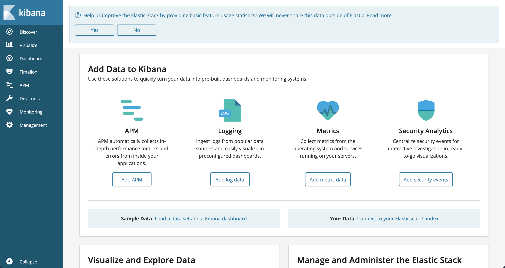

좌측 패널에서 Dev Tools를 눌러 이동하자.
파일럿 프로젝트 중반부에, 키바나의 시각화 과정에 지도를 쓸 예정인데, 해당 지도의 좌표타입을 geo_point로 엘라스틱서치에서 인덱싱되도록
미리 맵핑설정을 진행해보자.

좌측 Console 입력란에 아래와같이 입력하고, run 버튼을 클릭해, 맵핑적용 정보를 주입한다.
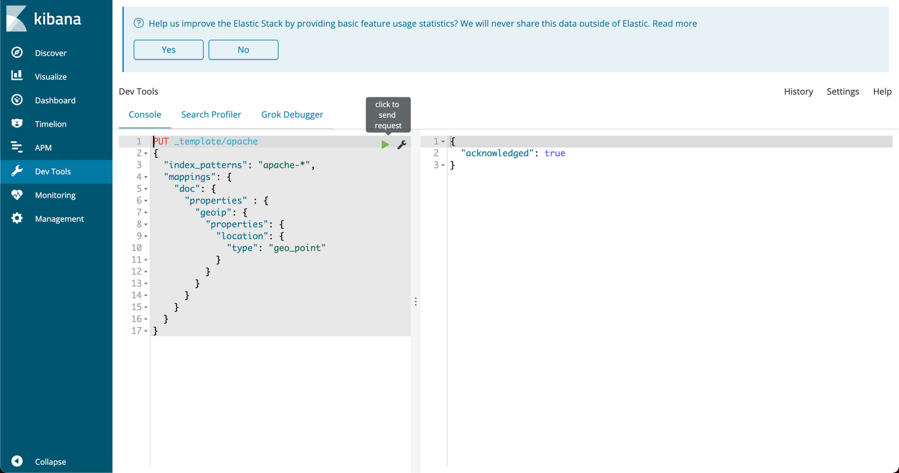

그림에서 index_patterns를 보면 apache-* 로 작성되어있다. apache-* 로 들어오는 인덱스로부터 mappings 내용과같이 맵핑하겠단 의미이다.

### 1.2.3 파일로부터 데이터 수집
사전 준비된 데이터를 logstash를 사용하여 수집하도록 하자.

수집하기 위해 파이프라인을 아래와 작성한다.
```shell
input{
  file {
    path => "$ELASTICSTACK_HOME/pilot01/apache-access.log"
    start_position => "beginning"
    sincedb_path => "/dev/null"
  }
}
filter {
  grok {
    match => { "message" => "%{HTTPD_COMBINEDLOG"}
  }
}
output {
  stdout{}
}
```
grok 필터를 통해, 로그스태시 사전 정의 필터에서 httpd 필터에 해당하는 combinedlog로 입력데이터를 포멧팅한다.
[👉%{HTTPD_COMBINEDLOG}]('https://github.com/logstash-plugins/logstash-patterns-core/tree/master/patterns/legacy/httpd)

로그스태시를 구동하여, 해당 파이프라인을 동작시키자
```shell
$ELASTICSTACK_HOME/restart.sh logstash -f $LOGSTASH_HOME/pipeline/pilot01-pipeline.conf
```

로그스태시 로그를 확인해보니, 기존 로그스태시 동작했을 때 출력하던 단순 message가 아닌, HTTPD_COMBINEDLOG 포멧에 맞춰 새로운 key로 값들이 맵핑되어 출력되었다.
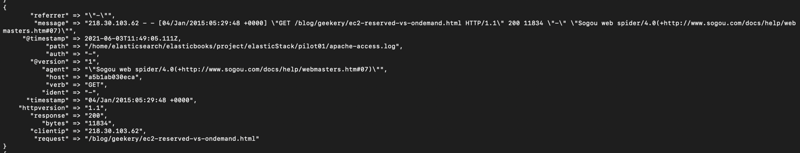

만약 입력 대상이 되는 파일이 패턴과 불일치하다면 아래와같이 파싱 실패 메시지도 출력된다.
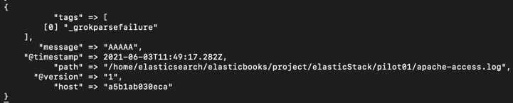

grok filter로 message 파싱을 완료하였으니, 이번엔 Mutate 필터를 사용해서 불필요한 필드를 제거해보자
제거할 필드명은 'auth'와 'ident'이다.

추가로, convert 옵션을 사용하여, bytes와 response 필드의 타입을 integer로 바꾸자

```shell
input{
  file {
    path => "$ELASTICSTACK_HOME/pilot01/apache-access.log"
    start_position => "beginning"
    sincedb_path => "/dev/null"
  }
}
filter {
  grok {
    match => { "message" => "%{HTTPD_COMBINEDLOG"}
  }
  mutate {
    remove_field => ['auth','ident']
  }
}
output {
  stdout{}
}
```

필터를 적용하고 다시 로그스태시를 동작시켰더니, 불필요한 필드는 제거되고 기존에 String 타입으로 작성된 bytes와 repsonse가 integer타입으로 바뀌었다.

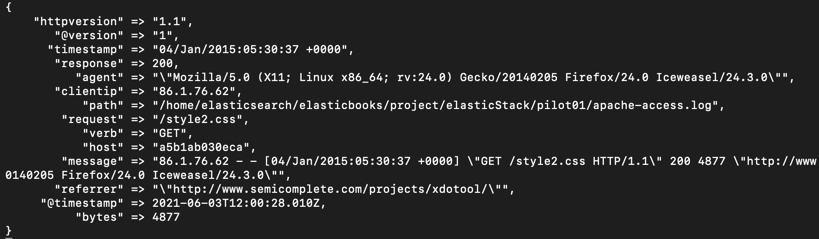

이번엔, date 필터를 추가하여 아파치 로그의 타임스탬프 포멧에 맞춰 String 형태로 저장되던 타임스탬프를 타임스탬프 형식으로 바꾸는 작업.
geoip 플러그인을 통해, 요청에 대한 위치 정보를 획득하도록 하자.

```shell
input {
  file {
    path => "${ELASTICSTACK_HOME}/pilot01/apache-access.log"
    start_position => "beginning"
    sincedb_path => "/dev/null"
  }
}
filter {
  grok {
    match => {"message" => "%{HTTPD_COMBINEDLOG}"}
  }
  mutate {
    remove_field => ['auth','ident']
    convert => { "bytes" => "integer" }
    convert => { "response" => "integer" }
  }
  date {
     match => [ "timestamp", "dd/MMM/yyyy:HH:mm:SS Z" ]
     target => "timestamp"
  }
  geoip {
    source => "clientip"
    target => "geoip"
  }
}
output {
  stdout {}
}
```

새로운 geoip 필드가 추가되었고, 기존 String타입으로 저장되던 타임스탬프도 포멧에 맞게 timestamp 형식으로 작성되었다.
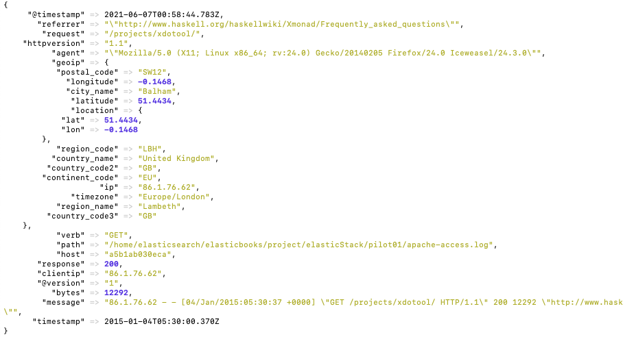

### 1.2.5 엘라스틱서치로 인덱싱
기존 실험환경에서는 필터링된 데이터를 output 단계에서 출력해주는 수준으로 테스트하였다. 이번에는 엘라스틱서치에 데이터를 저장하고,
저장된 데이터를 kibana를 사용하여 모니터링으로 출력해주는 수준까지 작업해보도록하자.

다시 pilot01의 파이프라인을 열고, output 단계에 elasticsearch 플러그인을 추가하자.

```shell
input {
  file {
    path => "${ELASTICSTACK_HOME}/pilot01/apache-access.log"
    start_position => "beginning"
    sincedb_path => "/dev/null"
  }
}
filter {
  grok {
    match => {"message" => "%{HTTPD_COMBINEDLOG}"}
  }
  mutate {
    remove_field => ['auth','ident']
    convert => { "bytes" => "integer" }
    convert => { "response" => "integer" }
  }
  date {
     match => [ "timestamp", "dd/MMM/yyyy:HH:mm:SS Z" ]
     target => "timestamp"
  }
  geoip {
    source => "clientip"
    target => "geoip"
  }
}
output {
  elasticsearch {
    hosts => ["localhost:9200"]
  }
  stdout {}
}
```

위와 같이 작성한 뒤, logstash를 재구동하고, curl 명령을 통해 elasticsearch에 인덱싱 된 데이터를 확인해보자.

```shell
${ELASTICSTACK_HOME}/start.sh logstash -f ${LOGSTASH_HOME}/pipelines/pilot01-pipeline.conf
${ELASTICSTACK_HOME}/start.sh elasticsearch
```

```shell
curl -XGET "localhost:9200/_cat/indices?v&pretty"
```
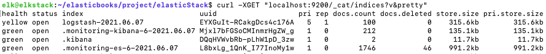

데이터의 인덱스 이름을 지정하지 않았기때문에 logstash-{날짜포멧} 형태로 인덱싱된 것을 확인할 수 있다.

해당 인덱스를 확인해보기 위해 아래의 명령을 작성해보자.

```shell
curl -XGET "localhost:9200/logstash*/_search?pretty"
```
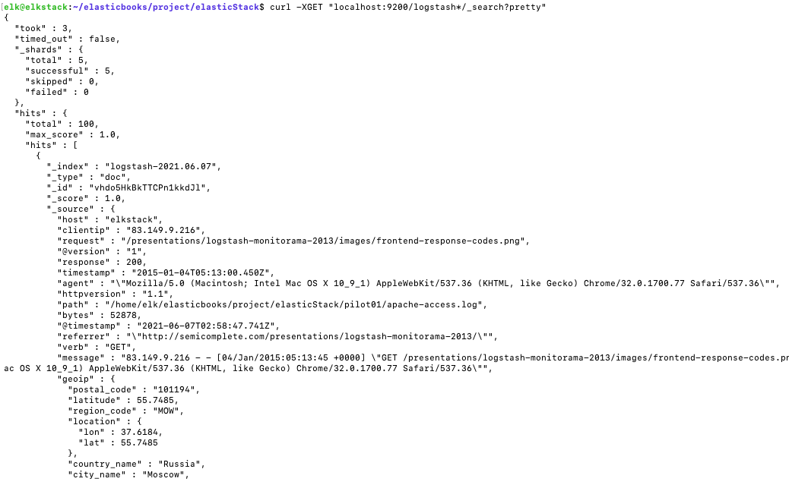

데이터 정제를 통해, elasticsearch로 데이터가 정상 인덱싱 된 것을 확인할 수 있다.

이번엔, 인덱스를 지정하여, logstash-{날짜포멧} 형태가 아닌 apache-web-log 로써 인덱싱될 수 있도록 처리해보자

elasticsearch 플러그인에 인덱스를 명시하자.

```shell
input {
  file {
    path => "${ELASTICSTACK_HOME}/pilot01/apache-access.log"
    start_position => "beginning"
    sincedb_path => "/dev/null"
  }
}
filter {
  grok {
    match => {"message" => "%{HTTPD_COMBINEDLOG}"}
  }
  mutate {
    remove_field => ['auth','ident']
    convert => { "bytes" => "integer" }
    convert => { "response" => "integer" }
  }
  date {
     match => [ "timestamp", "dd/MMM/yyyy:HH:mm:SS Z" ]
     target => "timestamp"
  }
  geoip {
    source => "clientip"
    target => "geoip"
  }
}
output {
  elasticsearch {
    hosts => ["localhost:9200"]
    index => "apache-web-log-%{+yyyy.MM.dd}"
  }
  stdout {}
}
```

logstash의 날짜 포멧을 사용하여, 인덱스에 날짜도 작성될 수 있도록 처리하였다.

다시 logstash를 재구동하여, elasticsearch에 상기 인덱스 포멧으로 인덱싱 되는지 확인하자.

```shell
${ELKSTACK_HOME}/start.sh logstash -f ${LOGSTASH_HOME}/pipeline/pilot01-pipeline.conf
```

```shell
curl -XGET "losthost:9200/_cat/indices?v&pretty"
```
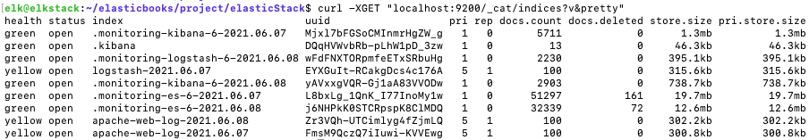

입력한 인덱스 형태로 데이터가 인덱싱되었다.

### 1.2.6 키바나로 시각화

이젠 Kibana UI에 접근하여 인덱스 패턴을 정의하고, 해당 인덱스를 Kibana를 통해 확인해보자.

먼저, 키바나를 실행시키자.
```shell
${ELKSATCK_HOME}/start.sh kibana
```

http://localhost:9200 으로 접근한 뒤, Management로 이동하자.
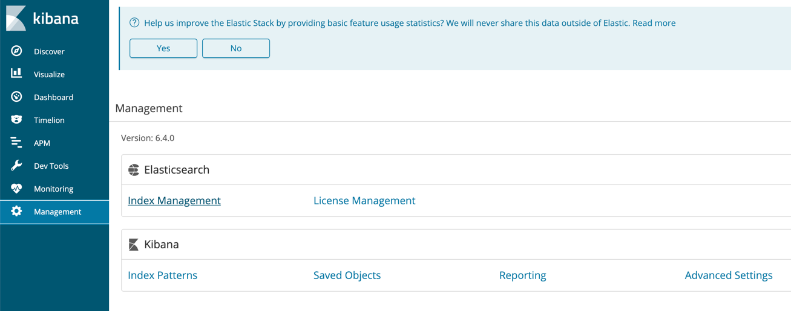

Kibana의 Index Patterns를 클릭하자
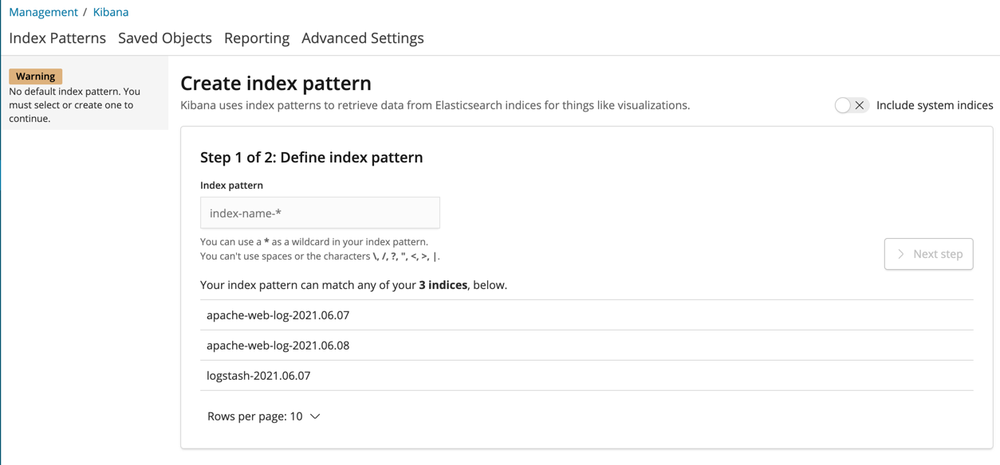

Index Pattern에 apache-web-log-* 로 명시하면, elasticsearch에 인덱싱 된 인덱스 중
해당 패에 포함되는 인덱스를 출력해준다.

인덱스 파일을 시각화 하기 위해, time 필의 필드명을 선택해준다. 선택 가능 범위로는 @timestamp와 timestamp가 존재하는데,
@timestamp는 logstash를 통해 elasticsearch에 기록되는 시점에서의 시간이고, timstamp가 실제 로그가 기록된 시간이다.
따라서, timestamp를 선택하고 인덱스 패턴을 생성하자.

인덱스 패턴이 생성되었고, 각 필드에 대한 정의를 확인할 수 있다.
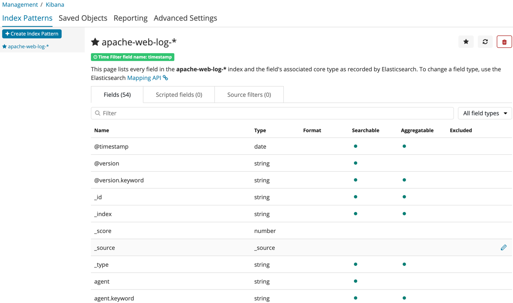

Discover 메뉴에 접근하면, 우리가 입력한 apache-web-log 에 따라 정보가 출력되어야하지만 그렇지않다. 입력된 로그가 현재 시간 기준
실시간 로그가 아닌, 과거의 로그를 데이터로 사용했기 때문이다.

우측 상단의 시계를 클릭 > Absolute 탭을 클릭하여, 2015년 1월 4일자의 데이털를 범위로 지정하자.

그럼 아래와 같이 로그에 대한 데이터를 확인할 수 있고, 좌측 패널을 통해 필드별로 통계정보를 확인하거나, 원하는 필드만 출력하게 하는 등
로그 데이터를 보다 편리하게 확인할 수 있다.

키바나에서는 만들어진 시각화(Visualize)나 대시보드를 모두 오브젝트로 저장할 수 있는데, 이 저장된 데이터를 기반으로
또다른 데이터를 시각화 및 대시보드 확인하는 용도로 재사용할 수 있다.
즉, 한번 틀을 잘 잡아둔 시각화 및 대시보드를 저장해두면, 여러번 재사용할 수 있다는 의미이다.

예제에서 제공되는 apache_visualization_export.json 과 apache_dashboard_export.json 을 임포트 해보자.

Management > Kibana의 Saved Object 메뉴로 이동하자.
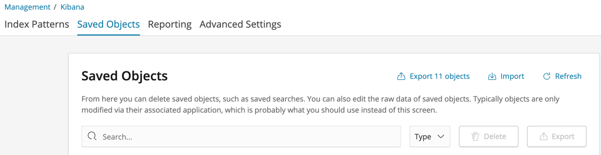

우측 상단에 Import 버튼을 눌러 사전 준비된 json 파일을 임포트하자.
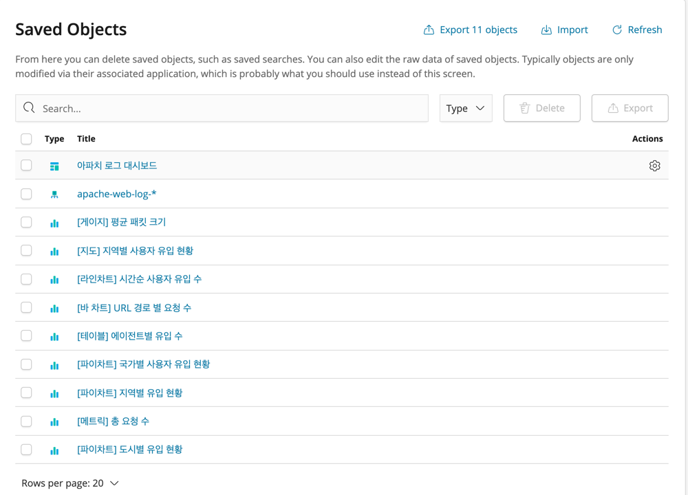

Dashboard 메뉴로 이동한 뒤, 아파치 로그 대시보드를 선택하면, apache-web-log에 대한 대시보드를 확인할 수 있다.
책에서는 위치 정보에 해당하는 지도도 표시되고, URL 경로별 요청 수 추이도 확인할 수 있는데, 왜 나는 안되는지 모르겠다...
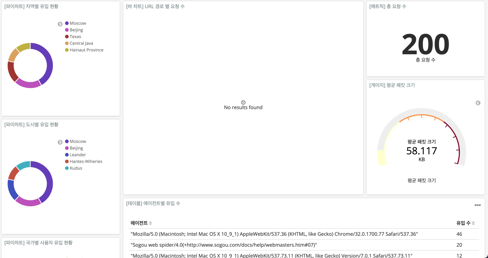