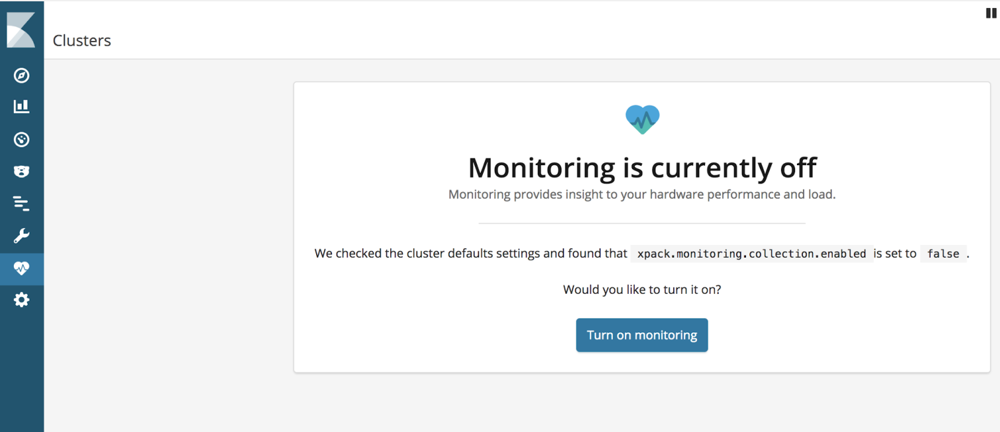
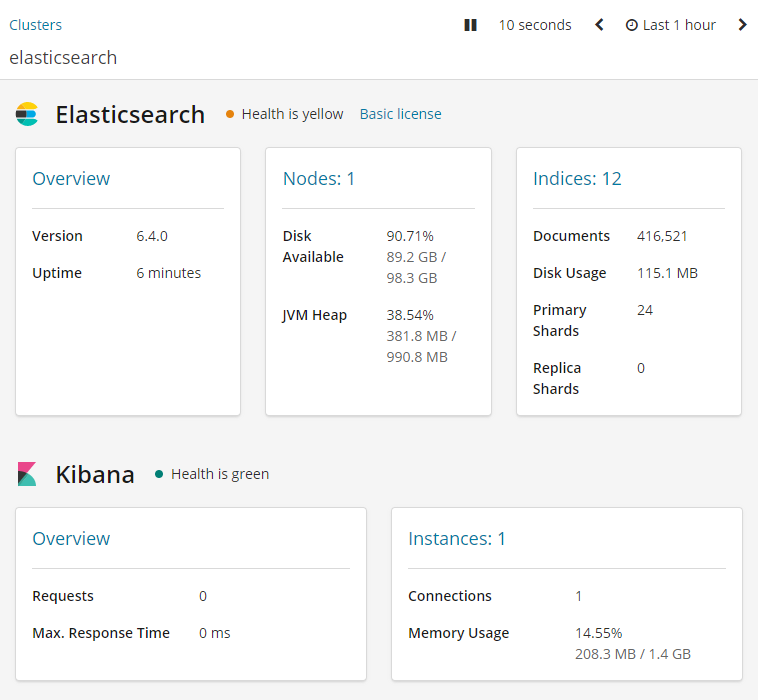
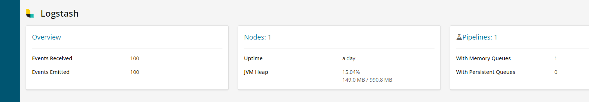

## 1.3 로그스태시 모니터링
엘라스틱 서치에 X-Pack이라는 확장 프로그램을 추가하면 로그스태시가 설치된 호스트에서 에이전트로 동작하며 로그스태시의 상태와 성능 지표를 수집한다.
즉, 로그스태시에 대한 모니터링이 가능하다. 수집되는 데이터는 JVM, 프로세스 상태 체크 등 다양한 정보를 제공한다. 이 데이터는 마찬가지로
엘리스탁서치에서 인덱싱되고 키바나를 통해 시각화 한다. 엘라스틱 스택을 모니터링 하기 위해서는 키바나와 엘라스틱서치가 구성된 상태에서 X-Pack을 설치해야 한다.
X-Pack의 일부 기능은 무료이지만 머신러닝, 보안 등은 유료로 제공한다. 우리는 그 중 무료 기능 몇가지만 써보도록 하자.

### 1.3.1 로그스태시와 모니터링 개요
X-Pack 모니터링 기능을 활성화하면 수집기와 출력이 자동으로 생성된다. 이는 로그스태시의 동작과는 전혀 무관하게 독립적으로 동작한다.

- 수집기

수집기는 이름 그대로 모니터링에 필요한 메트릭 데이터를 수집하는 역할을 수행한다.
수집기는 로그스태시의 파이프라인 설정과 마찬가지로 입력을 설정한다. 로그스태시의 CPU, Memory 자원에 대한 메트릭 정보와 파이프라인 상태 관련 메트릭 정보를 수집한다.
데이터는 10초간격으로 수집되며, 수집된 데이터는 Output을 거쳐 엘라스틱서치에 인덱싱된다.

- 출력

로그스태시와 마찬가지로 모니터링 데이터를 엘리스틱서치로 인덱싱된다. X-Pack의 경우 Output 단계로 엘라스틱서치에만 사용할 수 있다.
출력 설정(elasticsearch 호스트 설정 등)은 logsatsh.yml 파일에서 할 수 있다.

### 1.3.2 모니터링을 위한 환경 구성

엘라스틱서치를 실행하고, 로그 기록을 확인하면, started라는 메시지가 출력되고, X-Pack이 기본 라이선스(무료)로 적용된다. 기본 설정 상태에서는
X-Pack 모니터링 기능이 비활성화 되어있다.

키바나도 마찬가지로 실행단계의 로그 기록을 확인하면, X-Pack 모니터링이 기본 라이선스로 활성화 되는 것을 확인할 수 있다.

### 1.3.3 모니터링 기능 활성화
키바나 UI에서 Monitoring 메뉴로 이동하면, 아래와같은 화면이 출력된다.


기존 엘라스틱서치 6.0 이전 버전에서의 경우, X-Pack을 사용자가 직접 설치하고 설정하였지만, 6.0버전 부터는 기본으로 X-Pack이 포함되어있어,
Turn on monitoring 버튼을 클릭하는 것만으로 X-Pack을 활성화할 수 있다.

버튼을 클릭하면 아래와같이 Monitoring 페이지가 출력된다.


다음으로 로그스태시의 X-Pack을 활성화하기 위해, logsatsh.yml파일을 열고, xpack.monitoring.enabled 설정의 주석을 제거하자.
```shell
vi $LOGSTASH_HOME/config/logstash.yml
```
```shell
xpack.monitoring.enalbed: true
```

이제는 키바나 UI의 모니터링 메뉴에서 Logstash의 모니터링 정보도 확인할 수 있게 되었다.


Elasticsearch, Kibana, Logstash 모니터링 개요, 노드별 상태체크 등 다양한 정보를 확인할 수 있다.
자세한 내용은 직접 X-Pack을 활성화하여 확인해보길 바란다.