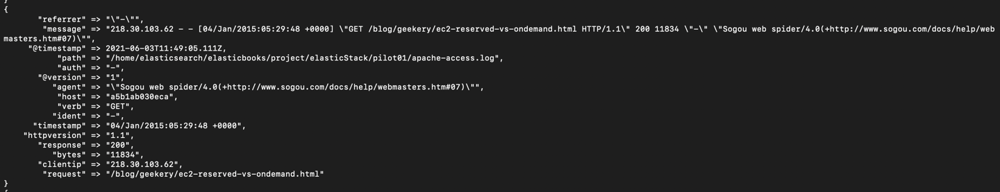
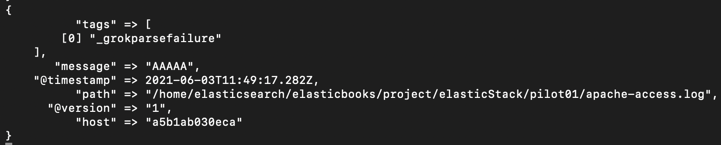
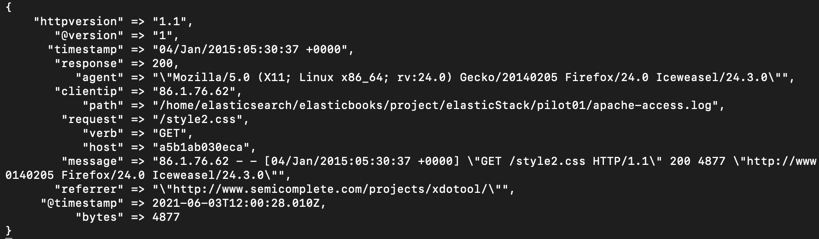
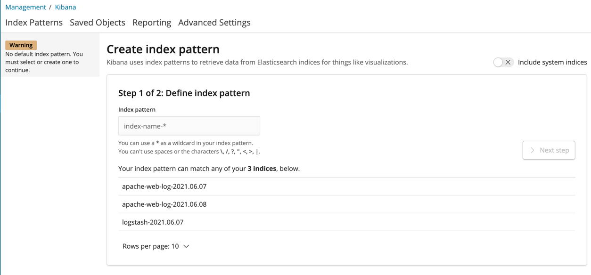
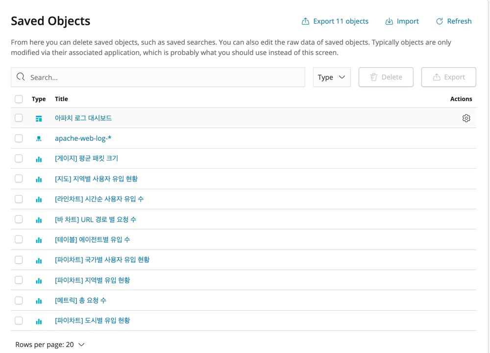
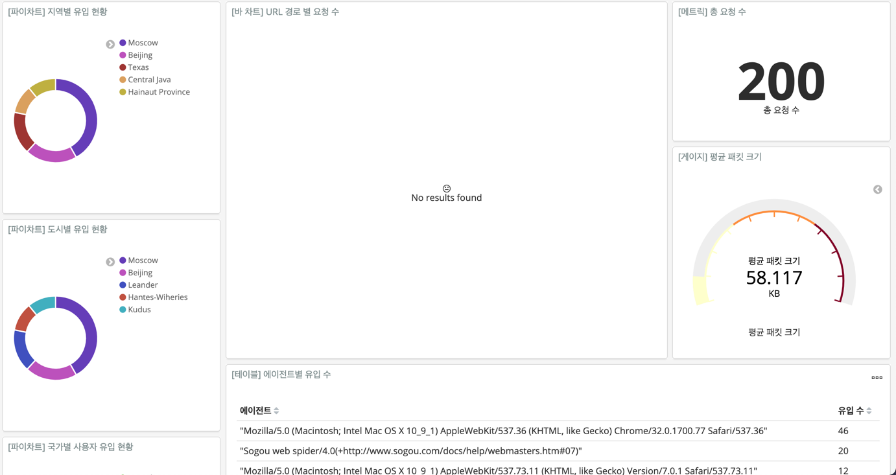

# 1. LogStash
로그 스태시는 데이터를 수집, 가공하여 다른 저장소(여기서는 엘라스틱 서치)에 데이터를 전송하는 **데이터 처리 파이프라인** 이다.
기본 기능 외에도 다양한 플러그인을 지원하여, LogStash의 기능이나 역할 범위를 확장할 수 있다.

로그 스태시의 파이프라인은 입력(Input), 필터(Filter), 출력(Output)으로 기본 구성되며, 각자의 역할을 명확히 한다. 각 파이프라인에서의 단계는 여러 플러그인의 조합으로 구성되며,
순차적으로 실행된다.

예를 들어, 입력단계에서 파일 플러그인을 통해 파일을 로드하고, 필터 단계에 로드된 데이터를 JSON으로 파싱하여, 출력단계에서 엘라스틱에 저장하는 식의 원리처럼 말이다.

최근에는 ELK Stack에 대한 관심도가 높아지면서, 여러 상황을 고려한 아키텍쳐에 대해 고안되고있는데, 이러한 여러 아키텍쳐를 효과적으로 구현하도록 돕는 비츠(Beats) 플랫폼도 생겨나고
이밖에 다양한 플러그인들이 추가 개발되고 있다.

이 ELK Stack을 실제 응용하여 원하는 아키텍쳐를 구현 즉, 적절한 상황에 다양한 플러그인을 조합하여 원하는 형태로 사용하는 역할은 우리의 몫이다.

## 1.1 로그스태시와 파이프라인
파이프라인은 로그스태시 홈 디렉터리의 config 디렉터리 안에 설정파일을 구성하여 작성한다. 해당 설정 파일은 Ruby 언어를 사용한다.
해당 설정파일을 통해, 값 설정 외에도 다양한 조건을 작성할 수 있다.

로그스태시는 파이프라인 설정 파일을 작성하지 않은 상태로는 구동될 수 없다.

> ERROR: Pipelines YAML file is empty. Location : $LOGSTASH_HOME/config/pipelines.yml

로그 스태시 홈디렉터리를 지정하고, 해당 디렉터리 내에 pipeline 디렉터리를 생성한다.
```shell
mkdir $LOGSTASH_HOME/pipeline
```

생성된 파이프라인 디렉터리에 1번 파이프라인을 작성한다.

```shell
vi $LOGSTASH_HOME/pipeline/first-pipeline.conf
```

```shell
input {
  stdin {}
}
filter {
  
}
output{
  stdout {}
}
```
앞서 언급한 바와 같이, 로그스태시 파이프라인은 루비 언어 기반으로 작성한다.

기본 파이프라인 작성은 완료되었고, 위의 파이프라인과 같이 키보드 입력을 받은(input단계)내용을
필터를 걸쳐 출력(output단계) 해주는 간단한 파이프라인이다. 이를 구동해보도록 하자!

우선 파이프라인 설정을 저장하고 해당 파이프라인 설정 파일 위치를 로그스태시가 인식할 수 있도록 설정해야한다.
설정파일 경로는 config/logstash.yml 이나 config/pipeline.yml 설정 파일을 통해 작성하거나 또는 로그스태시 실행 시 -f 옵션으로 파일을 직접 지정할 수 있다.


 #### config/logstash.yml 파일에 파이프라인 설정 파일 디렉터리 지정하기
이 파일은 로그스태시를 위한 다양한 설정을 지정할 수 있는데, 기본 제공하기 위한 것 외에는 모두 주석처리 되어있다. 따라서, 제공받고자하는 대상의 주석을 해제하고 설정해야한다.
우리는 로그스태시 구동을 위해 작성한 파이프라인의 설정 정보 경로를 지정할 것이다.

주석 처리된 **path.config** 항목을 찾아 주석을 해제하고, 파이프라인 경로를 작성한다.

```shell
path.config: '${LOGSTASH_HOME}/pipeline'
```

설정 완료 후, 로그 스태시 홈 디렉터리의 bin 디렉터리로 이동 후, logstash 쉘스크립트 파일을 실행하자.

```shell
root@1835c8716a82:~/elasticbooks/project/elasticStack/programs/logstash/bin# ./logstash
Sending Logstash logs to /root/elasticbooks/project/elasticStack/programs/logstash/logs which is now configured via log4j2.properties
[2021-06-02T07:08:05,885][WARN ][logstash.config.source.multilocal] Ignoring the 'pipelines.yml' file because modules or command line options are specified
[2021-06-02T07:08:06,874][INFO ][logstash.runner          ] Starting Logstash {"logstash.version"=>"6.4.0"}
[2021-06-02T07:08:09,435][INFO ][logstash.pipeline        ] Starting pipeline {:pipeline_id=>"main", "pipeline.workers"=>4, "pipeline.batch.size"=>125, "pipeline.batch.delay"=>50}
[2021-06-02T07:08:09,626][INFO ][logstash.pipeline        ] Pipeline started successfully {:pipeline_id=>"main", :thread=>"#<Thread:0x325e64b0 run>"}
The stdin plugin is now waiting for input:
[2021-06-02T07:08:09,731][INFO ][logstash.agent           ] Pipelines running {:count=>1, :running_pipelines=>[:main], :non_running_pipelines=>[]}
[2021-06-02T07:08:10,135][INFO ][logstash.agent           ] Successfully started Logstash API endpoint {:port=>9600}
```

다음과 같이 출력되었다면, 파이프라인이 동작된 것이다.

작성한 파이프라인대로 input단계 수행을 위해 키보드 입력을 수행하고, output단계에 의해 입력된 값을 출력하는지 확인해보자

```shell
logstash pipeline
{
       "message" => "logstash pipeline",
    "@timestamp" => 2021-06-02T07:08:17.400Z,
          "host" => "1835c8716a82",
      "@version" => "1"
}
hello
{
       "message" => "hello",
    "@timestamp" => 2021-06-02T07:08:23.245Z,
          "host" => "1835c8716a82",
      "@version" => "1"
}
```

logstash pipeline 과 hello 라는 입력을 수행하였다. 메시지에 입력한 값이 잘 출력되었다.

#### -f 옵션을 사용한 파이프라인 동작
이번에는 파이프라인을 실행하는 방법으로 logstash.yml에 작성하여 파이프라인을 실행하는 방법이 아닌, -f 옵션을 사용하여 특정 파이프라인 설정파일을 지정해 동작시켜보자.

```shell
logstash -f $LOGSTASH_HOME/pipeline/first-pipeline.conf
```

오타없이 잘 입력했다면 기존 동작했던 방법과 동일하게 로그스태시가 파이프라인 설정 파일을 대상으로 동작시킬 것이다.

### 1.1.1 입력 플러그인
본격적으로 입력 플러그인을 사용하여 입력 데이터를 받아보자.

**파일 플러그인**
파일 플러그인은 linux 명령에서 tail 처럼 특정 파일 대상으로 새롭게 작성되는 이벤트를 감지하고 수집하는 역할을 하는
플러그인이라고 생각하면 간단하다. 예제에서는 파일 플러그인을 통해, 수집된 데이터를 가공한 후 출력 플러그인으로 엘라스틱서치를 지정해 인덱싱해보자.

```shell
touch $LOGSTASH_HOME/input.txt
```

해당 파일을 저격하여 해당 파일에 새로운 이벤트가 발생할때마다 파이프라인이 동작하여 엘라스틱서치에 데이터를 인덱싱할 것이다.
이제 파이프라인을 작성해보자.

파일명은 file_plugin.conf로 지정해서 테스트하였다.
```shell
input {
  file {
    path => "${LOGSTASH_HOME}/input.txt" //1)path
    start_position => "beginning" //2)start_position
  }
}
filter {
  
}
output {
  stdout {}
}
```

1) path : 파일 플러그인을 사용하기 위해 필수로 입력되어져야하는 값이다. 어떤 파일을 대상으로 파일 플러그인을 동작시킬지에 대한 대상을 지정하는 값이다.
해당 패스는 파일로 한정할 수도 있지만, 특정 디렉터리 내 존재하는 모든파일을 대상으로 지정하기위해 '*' 와일드 카드를 작성할 수도 있다.

2) start_position : 파일을 읽을 위치를 지정한다. beginning 과 end 둘 중 하나를 택할 수 있는데, 말그대로 파일의 시작점부터 데이터를 수집하거나 파일의 마지막부터 데이터를 수집한다.
기본값은 end이다.
   
   
작성된 파이프라인을 이제 다시 구동시켜보자.

```shell
$LOGSTASH_HOME/bin/logstash -f $LOGSTASH_HOME/pipeline/file_plugin.conf
```

우리의 입력 플러그인 대상은 파일이다. input.txt에 echo 커맨드를 사용하여, 임의의 데이터를 삽입하자.

```shell
echo "I Love Elastic">> $LOGSTASH_HOME/input.txt
```
입력에 따라, 해당 파일에 새로운 이벤트가 발생하게 되었다. input단계에 있는 파이프라인도 이를 감지했는지 아래와 같이
입력된 데이터를 출력하였다(output 단계에 의해).

```shell
{
          "path" => "/root/elasticbooks/project/elasticStack/programs/logstash/input.txt",
          "host" => "1835c8716a82",
      "@version" => "1",
    "@timestamp" => 2021-06-02T08:06:16.010Z,
       "message" => "I Love Elastic"
}
```

#### sincedb**

로그스태시는 파일로부터 데이터를 수집할 때마다 파일의 어디까지를 읽었는지 책갈피와같은 정보를 가지고있다. 그래서, 로그스태시가 중간에
부득이한 이유로 혹은 관리자의 무언가의 이유로 중단되어도 다시 시작하면 입력이 멈춘 시점부터 다시 진행한다. 그 내용을 sincedb에 담고있는 것이다.

sincedb 파일의 경로는 지정하지 않으면 디폴트로 $LOGSTASH_HOME/data/plugins/inputs/file에 저장하고,
logstash.yml 파일을 통해 수동으로 sincedb 파일이 생성되는 경로를 지정할 수 있다.

그리고 이 파일은 숨김파일이여서, 확인하기 위해 **ls -a 경로**로 확인해야한다.

.sincedb 파일이 수집하고있는 정보
 * inode 번호 : 파일 식별자
 * 파일 시스템의 메이저 디바이스 번호 : 
 * 파일 시스템의 마이너 디바이스 번호 : 
 * 파일 내의 현재 바이트 오프셋 : 현재 어디까지 읽었었는지 기록한다 
 * 최근 수정한 시점의 타임스탬프 
 * 해당 파일의 경로

아래 첫째 줄은 실제 .sincedb의 정보를 출력한 내용이며,
둘째 줄은 새로운 input정보를 입력 후 변경된 .sincedb의 정보이다.

```shell
1712785 0 165 362 1622621242.480729 /root/elasticbooks/project/elasticStack/programs/logstash/input.txt
1712785 0 165 365 1622637129.044123 /root/elasticbooks/project/elasticStack/programs/logstash/input.txt
```
내용을 보면 알 수 있듯이 파일 내의 현재 바이트 오프셋과 최근 수정한 시점의 타임스탬프만 변경되었다.

### 1.1.2 필터 플러그인
필터 플러그인 에서는 입력 플러그인 단계에서 수집된 데이터를 필터링 하는 단계로 생각하면 된다. 적절한 필터 플러그인을 사용하여, 입력된 데이터를 정제하여
필요한 정보를 만들 수 있도록 처리한다. 아래의 예시에서 대표적인 필터 플러그인들을 실제로 사용해보자.

#### Grok 플러그인
grok은 입력 데이터를 약 120개 가량의 정규표현식 패턴을 통해 처리한다. 해당 패턴은 **로그스태시 패턴 코어 깃허브**를 통해 찾아볼 수 있다. 몇몇 인기있는 로그 대상들은
  grok에서 이미 패턴을 정의하고 있다. 그래서 일일이 찾아 매핑하지 않아도 될 때도 있다.

하지만, 범용적이지 않는 경우에는 직접 패턴을 조합하여 구문 분석을 해야한다. 하지만, 직접 패턴을 조합하고 맞게 작성했는지 일일이 확인하는 과정은 불필요한 시간을 많이 요구할 수도있다.
그래서 '**Grok Debugger**'와 같은 사이트에서 패턴에 오류는 없는지 확인하여 적용하는 방법이 꽤 괜찮다.

#### Mutate 플러그인
Mutate는 입력데이터를 적절한 필드에 맵핑하고, 해당 필드 및 데이터에 대한 문자역 재가공 등을 수행할 수 있다. 엘라스틱 서치는 상대적으로 인덱싱된 데이터에 대한 변경 작업의 비용이 비싼편이기 때문에
  되도록 LogStash에서 데이터 가공을 해서 보내주는 것이 좋다.
  
```shell
filter {
  mutate {
    옵션명 => ["대상 필드명"=>"값"]
  }
}
```

아래의 내용은 Mutate 필터 플러그인에서 제공되는 옵션들이다.

* convert : 해당 필드의 타입을 다른 타입으로 변경한다.
* copy : 기존에 있는 필드를 다른 필드로 복사한다. 복사 시 필드의 이름이 같으면 재 정의된다.
* gsub : 정규표현식을 사용해 일치하는 모든 항목을 해당 문자열로 치환한다.
* Join : 대상 필드가 배열인 경우 구분 문자를 이용해 배열 요소를 결합한다. 배열이 아니면 무시한다.
* lowercase : 대상 필드의 문자열을 소문자로 바꾼다.
* merge : 배열 또는 해시로 된 두 필드를 병합한다. 문자열 필드를 병합하면 배열로 변환한다.
* rename : 필드 이름을 변경한다.
* replace : 필드의 값을 새 값으로 변경한다.
* split : 구분 문자를 사용해 필드의 문자열을 배열로 나눈다.
* strip : 필드 값에서 공백을 제거한다.
* update : 기존 필드를 새 값으로 갱신한다. 필드가 없으면 무시한다.
* uppercase : 대상 필드의 문자열을 대문자로 변환한다.
* add_field : 필드를 추가한다.
* add_tag : 태그를 추가한다.
* remove_field :필드를 제거한다.
* remove_tag :태그를 제거한다.


#### date 플러그인
Date 플러그인은 date 포멧의 String 값이나, timestamp 등을 일정한 날짜포멧에 맞춰 인덱싱할 수 있도록 하는 플러그인이다.
  예를 들어, input 데이터의 날짜 데이터가 String 형태라면 엘라스틱서치에서 쿼리나 집계 수행시 문제가 발생할 수 있다. 날짜 단위로 집계를 하거나
  쿼리를 수행할 때, 날짜라고 인식이 될수가없으니깐(String이라서).. 이러한 경우를 없도록 공통된 date 포멧으로 만들어주는 해당 플러그인을 사용하는 것이다.

아래의 항목은 date 필터 플러그인에서 사용 가능한 옵션이다.
* locale : 날짜 구문 분석을 수행할때 사용될 지역정보를 설정한다. 예를 들어 12월 01일 이라고 표현할 때 한글을 인식하려면 locale 정보에 ko_KR라고 표기되어있어야 인식이된다.
* match : 수집된 데이터의 날짜 형식에 맞는 포맷으로 지정하는 옵션이다. 입력된 일시 정보를 MMMM dd yyyy HH:mm:ss 와 같은 형태로 포맷팅을 해놓으면 해당 포맷팅에 일치하는
  정보만을 날짜 정보로 입력하는 그런 형태라고 생각하며 된다.
* tag_on_failure : 일치하는 항목이 없으면 필드에 값을 추가한다. 기본값은 ["_dateparsefailure"] 이다.
* target : 타입을 변환할 대상 필드를 지정한다. 기본값은 @timestamp이다.
* timezone : 날짜 구문 분석에 사용할 시간대 표준 ID를 지정(한국시를 예로 Asia/Seoul)한다. Joda-Time 페이지에서 해당 표준 ID를 확인할 수 있다.

date 필터 플러그인은 아래와 같이 사용한다.
```shell
filter {
  date {
    match => [ "필드명"ㅡ "날짜 포맷 1", "날짜 포맷2", ...]
    target => "타입을 변환할 대상 필드"
  }
}
```

### 1.1.3 출력 플러그인
출력 플러그인 단계에서는 엘라스틱서치 플러그인을 사용하여 데이터를 인덱싱하는 방법을 알아보자.

#### 엘라스틱서치 플러그인
 엘라스틱서치 플러그인을 설정하는 간단한 방법은 엘라스틱서치 호스트의 IP와 Port만 작성하여 지정하는 것이다.
 
```shell
input {
  
}
filter{
  
}
output{
  elasticsearch{
    hosts => ["localhost:9200"]
  }
  stdout{
  }
}
```
위의 에시처럼 플러그인을 여러개 작성할 수도 있다. 위처럼 엘라스틱서치 플러그인에 호스트의 IP, Port 정보만 기입하면, 그밖의 설정들은 모두 기본값으로 작성된다.
만약 데이터의 인덱스 이름을 지정하지 않으면 logstash-날짜 형태로 입력이 된다. 가급적 인덱스의 이름을 정의 해주도록 하자.

```shell
output{
  elasticsearch{
    host => ["localhost:9200"]
    index => "apache-web-log-%{+yyyy.MM.dd}"
  }
}
```

위의 예시에서 인덱스 상에 작성된 날짜 포멧은 로그스태시가 제공하는 날짜 포맷이다.


## 1.2 파일럿 프로젝트로 아파치 웹 로그 데이터 수집
이 파일럿 프로젝트를 통해, 아파치 웹 로그 데이터를 예시로 로그스태시를 사용해보자.

### 1.2.1 개요
이 프로젝트는 아파치 웹로그를 로그스태시를 통해 정제하고 엘라스틱서치에 저장하는 단계까지 진행된다.

아파치 웹로그 <---> 로그스태시 ---> 엘라스틱서치 <--- 키바나

### 1.2.2 사전 준비
엘라스틱서치와 키바나를 동작시켜보자
```shell
$ELASTICSTACK_HOME/start.sh elasticsearch
$ELASTICSTACK_HOME/start.sh kibana
```
프로젝트 내 사전 작성된 쉘스크립트는 ELK의 각 서비스를 nohup 커맨드를 사용하여, 백그라운드 프로세스로 구동시킨다.
별다른 동작을 수행하지는 않는다.

단, elasticsearch같은 경우는 실행 단계에서, -Enetwork.host 옵션이 들어가는데. 확실치는 않지만 엘라스틱서치 구동 호스트의 IP정보를 기입해야하나보다.

기본적으로 키바나와 엘라스틱서치를 구동하면 디폴트 포트로 예상되는 9300(elasticsearch)와 5601(kibana)포트를 쓰게된다.
웹 브라우저에서 http://localhost:5601로 접근해보자.

키바나의 대시보드화면이 눈에 들어온다.


좌측 패널에서 Dev Tools를 눌러 이동하자.
파일럿 프로젝트 중반부에, 키바나의 시각화 과정에 지도를 쓸 예정인데, 해당 지도의 좌표타입을 geo_point로 엘라스틱서치에서 인덱싱되도록
미리 맵핑설정을 진행해보자.

좌측 Console 입력란에 아래와같이 입력하고, run 버튼을 클릭해, 맵핑적용 정보를 주입한다.


그림에서 index_patterns를 보면 apache-* 로 작성되어있다. apache-* 로 들어오는 인덱스로부터 mappings 내용과같이 맵핑하겠단 의미이다.

### 1.2.3 파일로부터 데이터 수집
사전 준비된 데이터를 logstash를 사용하여 수집하도록 하자.

수집하기 위해 파이프라인을 아래와 작성한다.
```shell
input{
  file {
    path => "$ELASTICSTACK_HOME/pilot01/apache-access.log"
    start_position => "beginning"
    sincedb_path => "/dev/null"
  }
}
filter {
  grok {
    match => { "message" => "%{HTTPD_COMBINEDLOG"}
  }
}
output {
  stdout{}
}
```
grok 필터를 통해, 로그스태시 사전 정의 필터에서 httpd 필터에 해당하는 combinedlog로 입력데이터를 포멧팅한다.
[👉%{HTTPD_COMBINEDLOG}]('https://github.com/logstash-plugins/logstash-patterns-core/tree/master/patterns/legacy/httpd)

로그스태시를 구동하여, 해당 파이프라인을 동작시키자
```shell
$ELASTICSTACK_HOME/restart.sh logstash -f $LOGSTASH_HOME/pipeline/pilot01-pipeline.conf
```

로그스태시 로그를 확인해보니, 기존 로그스태시 동작했을 때 출력하던 단순 message가 아닌, HTTPD_COMBINEDLOG 포멧에 맞춰 새로운 key로 값들이 맵핑되어 출력되었다.


만약 입력 대상이 되는 파일이 패턴과 불일치하다면 아래와같이 파싱 실패 메시지도 출력된다.


grok filter로 message 파싱을 완료하였으니, 이번엔 Mutate 필터를 사용해서 불필요한 필드를 제거해보자
제거할 필드명은 'auth'와 'ident'이다.

추가로, convert 옵션을 사용하여, bytes와 response 필드의 타입을 integer로 바꾸자

```shell
input{
  file {
    path => "$ELASTICSTACK_HOME/pilot01/apache-access.log"
    start_position => "beginning"
    sincedb_path => "/dev/null"
  }
}
filter {
  grok {
    match => { "message" => "%{HTTPD_COMBINEDLOG"}
  }
  mutate {
    remove_field => ['auth','ident']
  }
}
output {
  stdout{}
}
```

필터를 적용하고 다시 로그스태시를 동작시켰더니, 불필요한 필드는 제거되고 기존에 String 타입으로 작성된 bytes와 repsonse가 integer타입으로 바뀌었다.



이번엔, date 필터를 추가하여 아파치 로그의 타임스탬프 포멧에 맞춰 String 형태로 저장되던 타임스탬프를 타임스탬프 형식으로 바꾸는 작업.
geoip 플러그인을 통해, 요청에 대한 위치 정보를 획득하도록 하자.

```shell
input {
  file {
    path => "${ELASTICSTACK_HOME}/pilot01/apache-access.log"
    start_position => "beginning"
    sincedb_path => "/dev/null"
  }
}
filter {
  grok {
    match => {"message" => "%{HTTPD_COMBINEDLOG}"}
  }
  mutate {
    remove_field => ['auth','ident']
    convert => { "bytes" => "integer" }
    convert => { "response" => "integer" }
  }
  date {
     match => [ "timestamp", "dd/MMM/yyyy:HH:mm:SS Z" ]
     target => "timestamp"
  }
  geoip {
    source => "clientip"
    target => "geoip"
  }
}
output {
  stdout {}
}
```

새로운 geoip 필드가 추가되었고, 기존 String타입으로 저장되던 타임스탬프도 포멧에 맞게 timestamp 형식으로 작성되었다.


### 1.2.5 엘라스틱서치로 인덱싱
기존 실험환경에서는 필터링된 데이터를 output 단계에서 출력해주는 수준으로 테스트하였다. 이번에는 엘라스틱서치에 데이터를 저장하고,
저장된 데이터를 kibana를 사용하여 모니터링으로 출력해주는 수준까지 작업해보도록하자.

다시 pilot01의 파이프라인을 열고, output 단계에 elasticsearch 플러그인을 추가하자.

```shell
input {
  file {
    path => "${ELASTICSTACK_HOME}/pilot01/apache-access.log"
    start_position => "beginning"
    sincedb_path => "/dev/null"
  }
}
filter {
  grok {
    match => {"message" => "%{HTTPD_COMBINEDLOG}"}
  }
  mutate {
    remove_field => ['auth','ident']
    convert => { "bytes" => "integer" }
    convert => { "response" => "integer" }
  }
  date {
     match => [ "timestamp", "dd/MMM/yyyy:HH:mm:SS Z" ]
     target => "timestamp"
  }
  geoip {
    source => "clientip"
    target => "geoip"
  }
}
output {
  elasticsearch {
    hosts => ["localhost:9200"]
  }
  stdout {}
}
```

위와 같이 작성한 뒤, logstash를 재구동하고, curl 명령을 통해 elasticsearch에 인덱싱 된 데이터를 확인해보자.

```shell
${ELASTICSTACK_HOME}/start.sh logstash -f ${LOGSTASH_HOME}/pipelines/pilot01-pipeline.conf
${ELASTICSTACK_HOME}/start.sh elasticsearch
```

```shell
curl -XGET "localhost:9200/_cat/indices?v&pretty"
```


데이터의 인덱스 이름을 지정하지 않았기때문에 logstash-{날짜포멧} 형태로 인덱싱된 것을 확인할 수 있다.

해당 인덱스를 확인해보기 위해 아래의 명령을 작성해보자.

```shell
curl -XGET "localhost:9200/logstash*/_search?pretty"
```


데이터 정제를 통해, elasticsearch로 데이터가 정상 인덱싱 된 것을 확인할 수 있다.

이번엔, 인덱스를 지정하여, logstash-{날짜포멧} 형태가 아닌 apache-web-log 로써 인덱싱될 수 있도록 처리해보자

elasticsearch 플러그인에 인덱스를 명시하자.

```shell
input {
  file {
    path => "${ELASTICSTACK_HOME}/pilot01/apache-access.log"
    start_position => "beginning"
    sincedb_path => "/dev/null"
  }
}
filter {
  grok {
    match => {"message" => "%{HTTPD_COMBINEDLOG}"}
  }
  mutate {
    remove_field => ['auth','ident']
    convert => { "bytes" => "integer" }
    convert => { "response" => "integer" }
  }
  date {
     match => [ "timestamp", "dd/MMM/yyyy:HH:mm:SS Z" ]
     target => "timestamp"
  }
  geoip {
    source => "clientip"
    target => "geoip"
  }
}
output {
  elasticsearch {
    hosts => ["localhost:9200"]
    index => "apache-web-log-%{+yyyy.MM.dd}"
  }
  stdout {}
}
```

logstash의 날짜 포멧을 사용하여, 인덱스에 날짜도 작성될 수 있도록 처리하였다.

다시 logstash를 재구동하여, elasticsearch에 상기 인덱스 포멧으로 인덱싱 되는지 확인하자.

```shell
${ELKSTACK_HOME}/start.sh logstash -f ${LOGSTASH_HOME}/pipeline/pilot01-pipeline.conf
```

```shell
curl -XGET "losthost:9200/_cat/indices?v&pretty"
```


입력한 인덱스 형태로 데이터가 인덱싱되었다.

### 1.2.6 키바나로 시각화

이젠 Kibana UI에 접근하여 인덱스 패턴을 정의하고, 해당 인덱스를 Kibana를 통해 확인해보자.

먼저, 키바나를 실행시키자.
```shell
${ELKSATCK_HOME}/start.sh kibana
```

http://localhost:9200 으로 접근한 뒤, Management로 이동하자.


Kibana의 Index Patterns를 클릭하자


Index Pattern에 apache-web-log-* 로 명시하면, elasticsearch에 인덱싱 된 인덱스 중
해당 패에 포함되는 인덱스를 출력해준다.

인덱스 파일을 시각화 하기 위해, time 필의 필드명을 선택해준다. 선택 가능 범위로는 @timestamp와 timestamp가 존재하는데,
@timestamp는 logstash를 통해 elasticsearch에 기록되는 시점에서의 시간이고, timstamp가 실제 로그가 기록된 시간이다.
따라서, timestamp를 선택하고 인덱스 패턴을 생성하자.

인덱스 패턴이 생성되었고, 각 필드에 대한 정의를 확인할 수 있다.


Discover 메뉴에 접근하면, 우리가 입력한 apache-web-log 에 따라 정보가 출력되어야하지만 그렇지않다. 입력된 로그가 현재 시간 기준
실시간 로그가 아닌, 과거의 로그를 데이터로 사용했기 때문이다.

우측 상단의 시계를 클릭 > Absolute 탭을 클릭하여, 2015년 1월 4일자의 데이털를 범위로 지정하자.

그럼 아래와 같이 로그에 대한 데이터를 확인할 수 있고, 좌측 패널을 통해 필드별로 통계정보를 확인하거나, 원하는 필드만 출력하게 하는 등
로그 데이터를 보다 편리하게 확인할 수 있다.

키바나에서는 만들어진 시각화(Visualize)나 대시보드를 모두 오브젝트로 저장할 수 있는데, 이 저장된 데이터를 기반으로
또다른 데이터를 시각화 및 대시보드 확인하는 용도로 재사용할 수 있다.
즉, 한번 틀을 잘 잡아둔 시각화 및 대시보드를 저장해두면, 여러번 재사용할 수 있다는 의미이다.

예제에서 제공되는 apache_visualization_export.json 과 apache_dashboard_export.json 을 임포트 해보자.

Management > Kibana의 Saved Object 메뉴로 이동하자.


우측 상단에 Import 버튼을 눌러 사전 준비된 json 파일을 임포트하자.


Dashboard 메뉴로 이동한 뒤, 아파치 로그 대시보드를 선택하면, apache-web-log에 대한 대시보드를 확인할 수 있다.
책에서는 위치 정보에 해당하는 지도도 표시되고, URL 경로별 요청 수 추이도 확인할 수 있는데, 왜 나는 안되는지 모르겠다...



## 1.3 로그스태시 모니터링
엘라스틱 서치에 X-Pack이라는 확장 프로그램을 추가하면 로그스태시가 설치된 호스트에서 에이전트로 동작하며 로그스태시의 상태와 성능 지표를 수집한다.
즉, 로그스태시에 대한 모니터링이 가능하다. 수집되는 데이터는 JVM, 프로세스 상태 체크 등 다양한 정보를 제공한다. 이 데이터는 마찬가지로
엘리스탁서치에서 인덱싱되고 키바나를 통해 시각화 한다. 엘라스틱 스택을 모니터링 하기 위해서는 키바나와 엘라스틱서치가 구성된 상태에서 X-Pack을 설치해야 한다.
X-Pack의 일부 기능은 무료이지만 머신러닝, 보안 등은 유료로 제공한다. 우리는 그 중 무료 기능 몇가지만 써보도록 하자.

### 1.3.1 로그스태시와 모니터링 개요
X-Pack 모니터링 기능을 활성화하면 수집기와 출력이 자동으로 생성된다. 이는 로그스태시의 동작과는 전혀 무관하게 독립적으로 동작한다.

 - 수집기

수집기는 이름 그대로 모니터링에 필요한 메트릭 데이터를 수집하는 역할을 수행한다.
