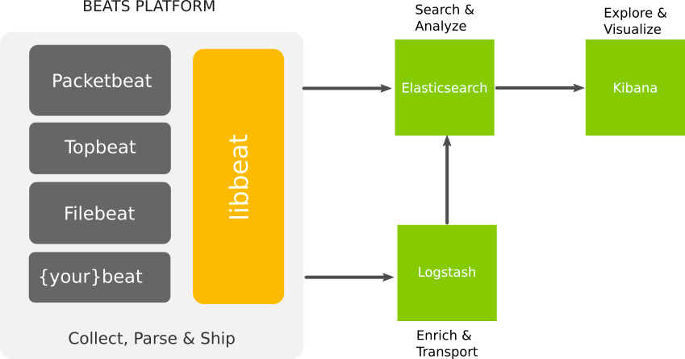
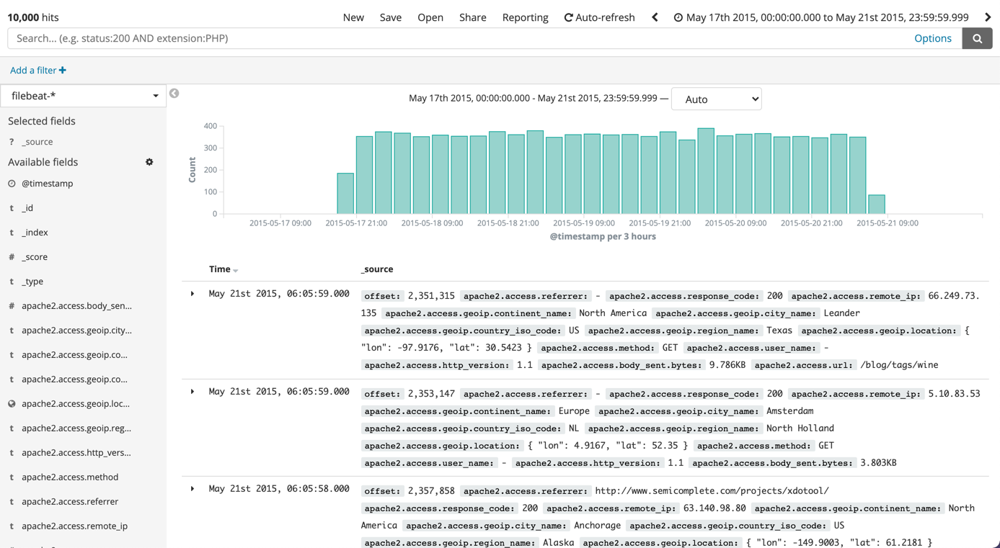
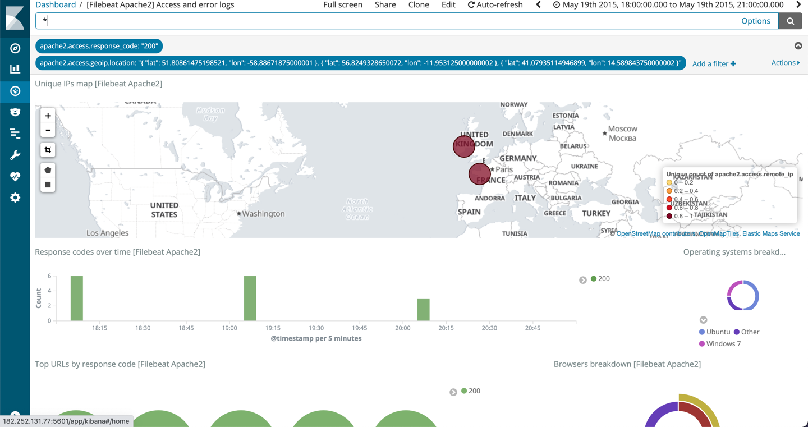
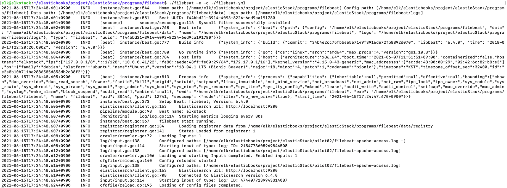

## 2.1 Filebeat로 아파치 웹 로그 수집
아파치나 Nginx 처럼 상용화된 대상들의 경우, 각 로그에 대해 미리 제작된 모듈이 있기 때문에
별도의 복잡한 설정(각 로그에 대해 어떻게 맵핑할 것이며, 어느 데이터를 수집할 것이고...)이 없이 데이터를 수집하고 시각화할 수 있다.
    
사용자는 사전에 구현된 여러 기능을 가져다 쓰기 쉽게 모아둔 libbeat 라이브러리와 필요한 구성요소를패키지화 한 비츠 제너레이터를 사용하여,
사용자의 요구를 충족시킬 수 있다.




### 2.1.1 Filebeat 개요
Filebeat는 파일로부터 데이터를 수집하는 경량화된 도구이다. 로그스태시보다 가볍고, 리소스 사용이 보다 적다.
Filebeat 이전에는 Logstash-forwarder라는 것이 Filebeat와 같은 역할을 수행하였다. Logstash-forwarder의
코드를 개선하고 테스트 코드를 추가하는 등의 개선이 되어 나온 것이 바로 Filebeat이다.

Filebeat의 구조는 단순하다. 데이터를 수집할 원격 서버에 에이전트를 설치하고, 로그를 수집할 대상 파일으 ㅣ경로와
로그를 전달받을 목적지로 로그스태시 또는 엘라스틱서치를 설정하면 동작하는 원리이다.

### 2.1.2 Filebeat의 구조
Filebeat의 디렉터리 구조는 아래와 같다.
```
kibana
 ㄴ 5
 ㄴ 6
module
 ㄴ apache2
 ㄴ auditd
 ㄴ icinga
 ㄴ kafka
 ㄴ logstash
 ㄴ mysql
 ㄴ nginx
 ㄴ osquery
 ㄴ postgresql
 ㄴ redis
 ㄴ system
 ㄴ traefik
modules.d
```
**kibana 디렉터리**에서는 kibana의 5, 6 버전 대의 대시보드가 있다. 키바나에서 해당 파일을 임포트하면 데이터를 손쉽게 시각화할 수 있다.
잘 알려진 로그 데이터 형식은 데이터 구문 분석과 엘라스틱서치의 인덱싱 방석이 module 디렉터리 하위에 이미 설정 파일로 작성돼 있다. 따라서 데이터 구조를 따로 파악하거나 복잡한 설정을 할 필요가 없다.
modules.d 디렉터리에는 각 모듈의 활성화 관련 설정 파일이 존재한다.

여러 모듈 중 Apache2 모듈을 사용하는 방법과 모듈 없이 파일을 지정해 데이터를 수집하는 방법을 알아보자.

### 2.1.3 Filebeat의 Apache2 모듈로 아파치 웹 로그 수집

Filebeat 모듈은 잘 알려진 로그 형식에 대한 설정을 가지고 있다. Filebeat는 엘라스틱서치의 인제스트(Ingest) 노드를 통해 엘라스틱서치로 데이터를 직접 전달한다.
만약 대량의 데이터를 엘라스틱 서치로 전달한다면, Filebeat로 직접 전달하는 방법보단, 로그스태시나 메시지 큐와 같은 서비스를 거쳐 전달하는게
부하를 분산시킬 수 있다.
Filebeat -> Logstash -> elasticsearch

Filebeat 하위 디렉터리인 module 내에는 아파치2나 NginX와 같은 모듈 관련 파일셋이 존재한다. 파일셋으로 모듈을 실행하면 다음과 같은 작업을 수행한다.
```
 - 로그 파일의 경로를 설정한다.
 - 여러 줄에 걸친 각각의 로그 이벤트를 단일 이벤트로 전송한다.
 - 로그 행을 인제스트 노드로 구문 분석하여 키바나에서 시각화기 적합한 구조의 데이터를 만든다.
 - 수집된 로그 데이터를 시각화하는 대시보드를 생성한다.
```

Apache2 모듈을 실행하면, 단순 문자열 데이터에 해당하는 로그데이터를 엘라스틱서치에서 인식할 수 있는 형태로 가공한다. 이 과정에서 엘라스틱서치의 인제스트 기능을 사용한다.
인제스트는 로그스태시의 필터 플러그인와 유사한 기능을 수행하는데, 이를 이용하려면 엘라스틱서치의 ingeset-user-agent와 ingest-geoip 플러그인이 필요하다.
또하나 중요한점은 Filebeat를 실행하기 이전에 엘라스틱서치와 키바나가 동작 중이어야 한다는 점이다.

```shell
$ELASTICSTACK_HOME/start.sh elasticsearch
$ELASTICSTACK_HOME/start.sh kibana
```

아래의 두명령으로 위에서 언급한 ingest-user-agent와 ingest-geoip 플러그인을 설치하자.

```shell
$ELASTICSTACK_HOME/bin/elasticsearch-plugin install ingest-user-agent
$ELASTICSTACK_HOME/bin/elasticsearch-plugin install ingest-geoip
```

설치 완료 후, 아래의 명령으로 엘라스틱서치를 재시작하여 플러그인을 활성화한다.
```shell
$ELASTICSTACK_HOME/restart.sh elasticsearch
```

filebeat는 구동 시, filebeat.yml 파일에서 모듈에 대한 설정 파일을 불러올 때, **\*.yml** 파일만을 불러오는데,
modules.d 디렉터리에 존재하는 우리가 테스트하고자하는 apache2의 설정 파일 명을 확인해보면 apache2.yml.disabled로 작성되어있다.
즉, 해당 설정파일은 비활성화 상태로 filebeat가 구동될 것이다.

Apache2 모듈을 활성화하기 위해, filebeat 커맨드로 Apache2 모듈에 대한 활성화 명령을 수행하자.
```shell

$FILEBEAT_HOME/filebeat -c $FILEBEAT_HOME/filebeat.yml modules enable apache2
```

추가적으로, Apache2 로그에 해당하는 Access 로그와 error로그 중 이번 테스트에서는 Access만 수집할 것이다.
Access 로그만 수집되도록 모듈 설정파일을 수정하고, var.paths 옵션을 통해 수집할 대상을 작성하자.

```shell
vi $FILEBEAT/modules.d/apache2.yml
- module: apache2

  access:
    enabled: true
    var.paths: ["${ELASTICSTACK_HOME}/pilot2/filebeat-apache-access.log"]
    
  error:
    enabled: false
```

정상적으로 활성화 되었는지 list 명령으로 현재 활성화된 모듈의 목록을 확인하자.
```shell
$FILEBEAT_HOME/filebeat -c $FILEBEAT_HOME/filebeat.yml modules list
```

아래의 리스트를 통해, Apache2 모듈이 정상적으로 활성화 되었다는 것을 확인할 수 있다.
```shell
Enabled:
apache2
Disabled:
auditd
elasticsearch
icinga
iis
kafka
kibana
logstash
mongodb
mysql
nginx
osquery
postgresql
redis
system
traefik
```

그 다음으로 filebeat 초기설정을 진행하자. 초기설정 단계에서 Apache2 모듈 외 다른 모듈은 초기설정하지 않도록 옵션을 부여하고, -e 옵션을 통해 syslog를 기록하지 않고, 콘솔에 출력되도록 설정하자.

```shell
$FILEBEAT_HOME/filebeat -e -c $FILEBEAT_HOME/filebeat.yml setup --modules apache2
```

위의 명령을 수행하면 활성화된 설정을 통해, 인덱싱을 담당할 엘라스틱서치에 설정을 반영하고 키바나에 샘플 대시보드와 filebeat-* 인덱스 패턴을 자동으로 생성한다.

이제 Filebeat를 실행하여 데이터를 수집하고 엘라스틱 서치로 전송해보자.

```shell
$FILEBEAT_HOME/filebeat -e -c $FILEBEAT_HOME/filebeat.yml
```

Kibana UI로 이동하여, Discover 메뉴로 접근했을 때, filebeat-* 패턴이 추가된 것을 확인할 수 있다.
수집된 대상 로그파일은 2015년 5월 17~ 212일 사이의 로그데이터 이므로, 기간 설정을 통해 해당 데이터를 확인하자.



앞서 언급한바와 같이, 각 로그 한줄에 해당하는 String 데이터가 filebeat에 의해 Apache2 포멧에 맞게 정상 수집되었고,
기간에 따른 수집된 정보의 양 등을 확인할 수 있다.

대시보드에서 [Filbeat Apache2] Access and error logs 대시보드를 선택해보자. 별도의 설정 작업 등이 없이 대시보드가 출력되는 것을 확인할 수 있다.



### 2.1.4 아파치 웹 로그 파일에서 데이터 수집
이번에는 아파치 모듈을 사용하지않고, 파일로부터 데이터를 수집하고 엘라스틱 서치로 인덱싱할 것이다. filebeat.yml 설정파일을 열자.

```shell
vi $FILEBEAT_HOME/filebeat.yml
```

```shell
filebeat.inputs:
- type: log 
  enable: true
  path: 
    - ${ELASTICSTACK_HOME}/pilot02/filebeat-apache-access.log
```
위에 내용에서
  type은 입력할 데이터의 유형을 의미한다. log 뿐만아니라 stdin, redis, udp, tcp, syslog, docker가 있다.
  enabled를 true로 설정할 경우 해당 입력을 사용한다. 여러 입력을 추가할 수 있다.
  paths에는 여러 경로를 지정할 수 있다. pths 경로는 Glob 패턴을 사용한다.

지정된 경로로부터 입력된 데이터를 엘라스틱서치로 전송해야한다.

```shell
output.elasticsearh:
  hosts: ["localhost:9200"]
  index: "filebeat-apache-access-%{+yyyy.MM.dd}"
setup.template:
  name: "filebeat-apache-access"
  pattern: "filebeat-apache-access-*"
  enabled: true
```

엘라스틱서치 호스트의 정보를 배열형태로 작성한다. 즉, 여러군데로 저장할 수 있다. 수집될 데이터의 인덱싱 형태를 작성한다.
setup.template 세션의 템플릿 이름과 패턴을 설정하는데, 자동으로 생성되는 템플릿의 경우 아파치 웹 로그와 같이 filebeat가 지원하는 로그 관련 매핑 설정이 최적화돼 있다.
그래서 해당 기능을 활성화 해두는 편이 좋다.

설정이 완료되었으면, Filebeat를 실행시켜 파일로부터 데이터가 엘라스틱 서치에 인덱싱되는지 확인해보자.
```shell
$FILEBEAT_HOME/filebeat -e -c $FILEBEAT_HOME/filebeat.yml
```


curl 명령을 통해, 앞서 설정한 템플릿을 확인해보자.
```shell
curl -XGET "http://localhost:9200/_template/filebeat-apache-access?pretty" | more
```

인덱싱된 데이터가 정상 출력되는 것을 확인할 수 있다.


### 2.1.5 로그스태시 결합