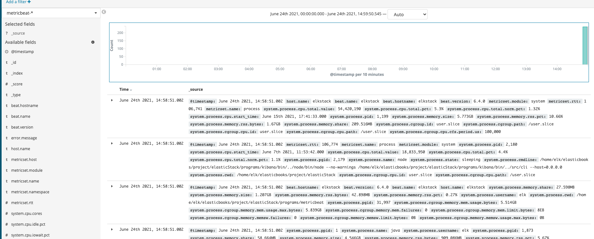
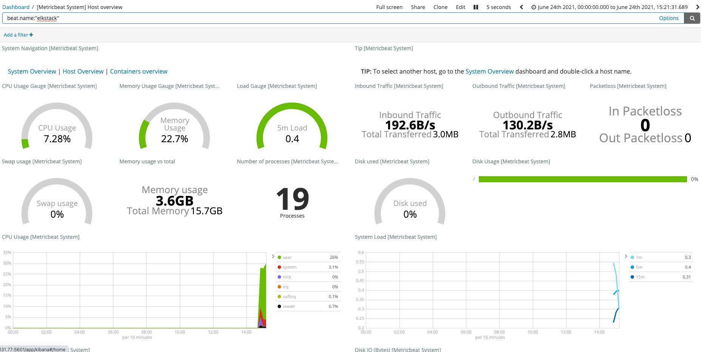

## 2.2 Metricbeat로 호스트 메트릭 수집
로그 수집목적은 다양하다. 대부분 수치 데이터를 연산, 시각화, 분석하여 의미있는 데이터로부터 더 좋은 서비스를 제공하기 위함이다.
Metricbeat는 대상 호스트의 OS관련 수치나 호스트에서 동작하는 여러 서비스의 수치 데이터를 수집한다.
이전 2.1.에서와 마찬가지로 Metricbeat로 데이터를 수집하여 logstash에 전달하고 이를 시각화할 것이다.

지원하는 서비스는 Apache, Jolokia, Nginx, MongoDB, MySQL, PostgreSQL, Prometheus 등으로 다양하다.
필요한 모듈이 없다면, Go언어 기반의 새로운 모듈을 직접 개발할 수도 있다.

### 2.2.1 Metricbeat 설정
Metricbeat의 사용방법은 Filebeat와 크게 다르지 않다. 이 모듈도 마찬가지로 데이터를 수집하고 시각화한다. 지금부터 다양한 모듈을 사용하여 호스트 OS의 여러 수치데이터를 수집할 것이다.

먼저 Metricbeat의 설정파일을 살펴보자.

`Modules Configuration`의 기본 설정은 다음과 같다.

```shell
metricbeat.config.modules:
  # Glob pattern for configuration loading
  path : ${path.config}/modules.d/*.yml
  # Set to ture to enable config reloading
  reload.enalbed: false
  # Period on which files under path should be checked for changes
  #reload.period: 10s

...

output.elasticsearch:
  # Arrays of hosts to connect to.
  hosts: ["localhost:9200"]
```
metricbeat.config.modules:
 - path : metricbeat의 모듈 설정 경로로, metricbeat 설치 경로 내 modules.d 디렉터리 내, `.yml`확장자를 사용하는 모든 모듈을 로드한다.
 - reload.enabled : 설정 파일의 재설정 기능을 활성화할지의 여부를 작성한다. 기본값은 false이다.
 - reload.period : 설정 파일의 재설정 주기를 설정한다.

output.logstash.hosts : 수집한 데이터의 출력으로 엘라스틱에 직접 인덱싱하도록 설정한다.

모듈 설정파일이 위치한 `modules.d`경로에 존재하는 모듈은 아래와 같다.
```shell
-rw-r--r-- 1 elk elk  209 Aug 18  2018 aerospike.yml.disabled
-rw-r--r-- 1 elk elk  241 Aug 18  2018 apache.yml.disabled
-rw-r--r-- 1 elk elk  424 Aug 18  2018 ceph.yml.disabled
-rw-r--r-- 1 elk elk  275 Aug 18  2018 couchbase.yml.disabled
-rw-r--r-- 1 elk elk  625 Aug 18  2018 docker.yml.disabled
-rw-r--r-- 1 elk elk  308 Aug 18  2018 dropwizard.yml.disabled
-rw-r--r-- 1 elk elk  276 Aug 18  2018 elasticsearch.yml.disabled
-rw-r--r-- 1 elk elk  209 Aug 18  2018 envoyproxy.yml.disabled
-rw-r--r-- 1 elk elk  258 Aug 18  2018 etcd.yml.disabled
-rw-r--r-- 1 elk elk  295 Aug 18  2018 golang.yml.disabled
-rw-r--r-- 1 elk elk  458 Aug 18  2018 graphite.yml.disabled
-rw-r--r-- 1 elk elk  217 Aug 18  2018 haproxy.yml.disabled
-rw-r--r-- 1 elk elk  653 Aug 18  2018 http.yml.disabled
-rw-r--r-- 1 elk elk  981 Aug 18  2018 jolokia.yml.disabled
-rw-r--r-- 1 elk elk  745 Aug 18  2018 kafka.yml.disabled
-rw-r--r-- 1 elk elk  255 Aug 18  2018 kibana.yml.disabled
-rw-r--r-- 1 elk elk 1066 Aug 18  2018 kubernetes.yml.disabled
-rw-r--r-- 1 elk elk  187 Aug 18  2018 kvm.yml.disabled
-rw-r--r-- 1 elk elk  261 Aug 18  2018 logstash.yml.disabled
-rw-r--r-- 1 elk elk  203 Aug 18  2018 memcached.yml.disabled
-rw-r--r-- 1 elk elk 1120 Aug 18  2018 mongodb.yml.disabled
-rw-r--r-- 1 elk elk  215 Aug 18  2018 munin.yml.disabled
-rw-r--r-- 1 elk elk  580 Aug 18  2018 mysql.yml.disabled
-rw-r--r-- 1 elk elk  349 Aug 18  2018 nginx.yml.disabled
-rw-r--r-- 1 elk elk  265 Aug 18  2018 php_fpm.yml.disabled
-rw-r--r-- 1 elk elk  290 Aug 18  2018 postgresql.yml.disabled
-rw-r--r-- 1 elk elk  536 Aug 18  2018 prometheus.yml.disabled
-rw-r--r-- 1 elk elk  271 Aug 18  2018 rabbitmq.yml.disabled
-rw-r--r-- 1 elk elk  441 Aug 18  2018 redis.yml.disabled
-rw-r--r-- 1 elk elk  752 Aug 18  2018 system.yml
-rw-r--r-- 1 elk elk  196 Aug 18  2018 traefik.yml.disabled
-rw-r--r-- 1 elk elk  200 Aug 18  2018 uwsgi.yml.disabled
-rw-r--r-- 1 elk elk  478 Aug 18  2018 vsphere.yml.disabled
-rw-r--r-- 1 elk elk  736 Aug 18  2018 windows.yml.disabled
-rw-r--r-- 1 elk elk  204 Aug 18  2018 zookeeper.yml.disabled
```
`system.yml`을 제외한 나머지는 `disabled` 상태이다. 필요한 모듈이 존재할 경우, disabled를 파일명에서 제거하고 설정하여 사용할 수 있다.
재시작없이 모듈을 적용하고싶다면, 앞서 언급한 reload module 설정을 활성화하면 된다.

먼저 `system.yml`파일을 살펴보자.
```shell
vi $METRICBEAT_HOME/modules.d/system.yml
```
```shell
# Module: system
# Docs: https://www.elastic.co/guide/en/beats/metricbeat/6.4/metricbeat-module-system.html

- module: system
  period: 10s
  metricsets:
    - cpu
    - load
    - memory
    - network
    - process
    - process_summary
    #- core
    #- diskio
    #- socket
  process.include_top_n:
    by_cpu: 5      # include top 5 processes by CPU
    by_memory: 5   # include top 5 processes by memory

- module: system
  period: 1m
  metricsets:
    - filesystem
    - fsstat
  processors:
  - drop_event.when.regexp:
      system.filesystem.mount_point: '^/(sys|cgroup|proc|dev|etc|host|lib)($|/)'

- module: system
  period: 15m
  metricsets:
    - uptime

#- module: system
#  period: 5m
#  metricsets:
#    - raid
#  raid.mount_point: '/'
```
 modules라는 키로 총 3구획으로 구분되어있는 것을 알 수 있다.
1번째 module 영역은 `cpu`,`load`,`memory`,`network`,`process`,`process_summary`의 메트릭 정보를 수집한다.
수집주기는 10초이며, `processors` 설정을 통해, 지정된 `output`으로 전달되기 이전 간단한 전처리가 가능하다.
기본 설정은 ['.*']이다.
2번쨰 module 영역은 1분 주기로 파일시스템 관련 데이터를 수집한다. `processors`에 `drop_event` 를 설정하면 정규 표현식으로 지정한 값은 엘라스틱서치로 전달하지 않는다.

### 2.2.2 Metricbeat로 데이터 수집

이제 본격적으로 데이터를 인덱싱해보자.
elasticsearch, kibana를 구동하자.
```shell
$ELASTICSTACK_HOME/start.sh elasticsearch
$ELASTICSTACK_HOME/start.sh kibana
```

Metricbeat 명령어를 통해, 현재 활성 및 비활성화 된 모듈을 확인하자.
```shell
$METRICBEAT_HOME/metricbeat -c $METRICBEAT_HOME/metricbeat.yml modules list
```
```shell
Enabled:
system

Disabled:
aerospike
apache
ceph
couchbase
docker
dropwizard
elasticsearch
envoyproxy
etcd
golang
graphite
haproxy
http
jolokia
kafka
kibana
kubernetes
kvm
logstash
memcached
mongodb
munin
mysql
nginx
php_fpm
postgresql
prometheus
rabbitmq
redis
traefik
uwsgi
vsphere
windows
zookeeper
```
현재는 system 모듈만 활성화 되어있다.

mysql 모듈을 활성화하자.
```shell
$METRICBEAT_HOME/metricbeat -c $METRICBEAT_HOME/metricbeat.yml modules enable mysql
```

이젠, Metricbeat를 실행하여 OS의 메트릭 정보를 수집하자.
```shell
$METRICBEAT_HOME/metricbeat -e -c $METRICBEAT_HOME/metricbeat.yml
```
```shell
2021-06-24T14:56:30.861+0900	INFO	instance/beat.go:544	Home path: [/home/elk/elasticbooks/project/elasticStack/programs/metricbeat] Config path: [/home/elk/elasticbooks/project/elasticStack/programs/metricbeat] Data path: [/home/elk/elasticbooks/project/elasticStack/programs/metricbeat/data] Logs path: [/home/elk/elasticbooks/project/elasticStack/programs/metricbeat/logs]
2021-06-24T14:56:30.862+0900	INFO	instance/beat.go:551	Beat UUID: 5d06bc0d-9072-4fcf-b0a9-de646a125ce9
2021-06-24T14:56:30.863+0900	INFO	[seccomp]	seccomp/seccomp.go:116	Syscall filter successfully installed
2021-06-24T14:56:30.863+0900	INFO	[beat]	instance/beat.go:768	Beat info	{"system_info": {"beat": {"path": {"config": "/home/elk/elasticbooks/project/elasticStack/programs/metricbeat", "data": "/home/elk/elasticbooks/project/elasticStack/programs/metricbeat/data", "home": "/home/elk/elasticbooks/project/elasticStack/programs/metricbeat", "logs": "/home/elk/elasticbooks/project/elasticStack/programs/metricbeat/logs"}, "type": "metricbeat", "uuid": "5d06bc0d-9072-4fcf-b0a9-de646a125ce9"}}}
2021-06-24T14:56:30.863+0900	INFO	[beat]	instance/beat.go:777	Build info	{"system_info": {"build": {"commit": "34b4e2cc75fbbee5e7149f3916de72fb8892d070", "libbeat": "6.4.0", "time": "2018-08-17T22:24:47.000Z", "version": "6.4.0"}}}
2021-06-24T14:56:30.863+0900	INFO	[beat]	instance/beat.go:780	Go runtime info	{"system_info": {"go": {"os":"linux","arch":"amd64","max_procs":4,"version":"go1.10.3"}}}
2021-06-24T14:56:30.865+0900	INFO	[beat]	instance/beat.go:784	Host info	{"system_info": {"host": {"architecture":"x86_64","boot_time":"2021-06-07T11:51:51+09:00","containerized":false,"hostname":"elkstack","ips":["127.0.0.1/8","::1/128","10.0.0.41/22","fe80::aede:48ff:fe00:29/64","172.17.0.1/16"],"kernel_version":"4.15.0-43-generic","mac_addresses":["ac:de:48:00:00:29","02:42:6c:82:b8:e3"],"os":{"family":"debian","platform":"ubuntu","name":"Ubuntu","version":"18.04.1 LTS (Bionic Beaver)","major":18,"minor":4,"patch":1,"codename":"bionic"},"timezone":"KST","timezone_offset_sec":32400,"id":"e2a8b10b711be2886585d853db2c38f2"}}}
2021-06-24T14:56:30.866+0900	INFO	[beat]	instance/beat.go:813	Process info	{"system_info": {"process": {"capabilities": {"inheritable":null,"permitted":null,"effective":null,"bounding":["chown","dac_override","dac_read_search","fowner","fsetid","kill","setgid","setuid","setpcap","linux_immutable","net_bind_service","net_broadcast","net_admin","net_raw","ipc_lock","ipc_owner","sys_module","sys_rawio","sys_chroot","sys_ptrace","sys_pacct","sys_admin","sys_boot","sys_nice","sys_resource","sys_time","sys_tty_config","mknod","lease","audit_write","audit_control","setfcap","mac_override","mac_admin","syslog","wake_alarm","block_suspend","audit_read"],"ambient":null}, "cwd": "/home/elk/elasticbooks/project/elasticStack/programs/metricbeat", "exe": "/home/elk/elasticbooks/project/elasticStack/programs/metricbeat/metricbeat", "name": "metricbeat", "pid": 31997, "ppid": 28745, "seccomp": {"mode":"filter","no_new_privs":true}, "start_time": "2021-06-24T14:56:29.890+0900"}}}
2021-06-24T14:56:30.867+0900	INFO	instance/beat.go:273	Setup Beat: metricbeat; Version: 6.4.0
2021-06-24T14:56:30.868+0900	INFO	elasticsearch/client.go:163	Elasticsearch url: http://localhost:9200
2021-06-24T14:56:30.868+0900	INFO	pipeline/module.go:98	Beat name: elkstack
2021-06-24T14:56:30.869+0900	INFO	[monitoring]	log/log.go:114	Starting metrics logging every 30s
2021-06-24T14:56:30.869+0900	INFO	instance/beat.go:367	metricbeat start running.
2021-06-24T14:56:30.872+0900	INFO	filesystem/filesystem.go:58	Ignoring filesystem types: sysfs, rootfs, ramfs, bdev, proc, cpuset, cgroup, cgroup2, tmpfs, devtmpfs, configfs, debugfs, tracefs, securityfs, sockfs, dax, bpf, pipefs, hugetlbfs, devpts, ecryptfs, fuse, fusectl, pstore, mqueue, autofs, overlay, aufs
2021-06-24T14:56:30.873+0900	INFO	fsstat/fsstat.go:59	Ignoring filesystem types: sysfs, rootfs, ramfs, bdev, proc, cpuset, cgroup, cgroup2, tmpfs, devtmpfs, configfs, debugfs, tracefs, securityfs, sockfs, dax, bpf, pipefs, hugetlbfs, devpts, ecryptfs, fuse, fusectl, pstore, mqueue, autofs, overlay, aufs
2021-06-24T14:56:30.873+0900	INFO	cfgfile/reload.go:140	Config reloader started
2021-06-24T14:56:30.877+0900	INFO	filesystem/filesystem.go:58	Ignoring filesystem types: sysfs, rootfs, ramfs, bdev, proc, cpuset, cgroup, cgroup2, tmpfs, devtmpfs, configfs, debugfs, tracefs, securityfs, sockfs, dax, bpf, pipefs, hugetlbfs, devpts, ecryptfs, fuse, fusectl, pstore, mqueue, autofs, overlay, aufs
2021-06-24T14:56:30.877+0900	INFO	fsstat/fsstat.go:59	Ignoring filesystem types: sysfs, rootfs, ramfs, bdev, proc, cpuset, cgroup, cgroup2, tmpfs, devtmpfs, configfs, debugfs, tracefs, securityfs, sockfs, dax, bpf, pipefs, hugetlbfs, devpts, ecryptfs, fuse, fusectl, pstore, mqueue, autofs, overlay, aufs
2021-06-24T14:56:30.878+0900	INFO	cfgfile/reload.go:195	Loading of config files completed.
2021-06-24T14:56:31.881+0900	INFO	elasticsearch/client.go:708	Connected to Elasticsearch version 6.4.0
2021-06-24T14:56:31.883+0900	INFO	template/load.go:82	Loading template for Elasticsearch version: 6.4.0
2021-06-24T14:56:32.258+0900	INFO	template/load.go:145	Elasticsearch template with name 'metricbeat-6.4.0' loaded
```

`system` 모듈의 설정 내용에 따라, 매 30초마다 OS의 메트릭 정보가 수집된다.

### 2.2.3 키바나로 시각화
시각화 역할을 수행하는 키바나는 Metricbeat의 `setup`명령으로 설정할 수 있다. 단 한번의 명령을 통해, 인덱스패턴과 시각화, 대시보드를 생성할 수 있다.
Metricbeat가 지원하는 모든 모듈은 해당 기능 수행이 가능하다.
```shell
$METRICBEAT_HOME/metricbeat -c $METRICBEAT_HOME/metricbeat.yml setup --dashboards
```

kibana UI의 `discover`메뉴로 이동하여 metricbeat 필터를 선택하면, 위의 기능을 통해 자동으로 만들어진 필터를 확인할 수 있다.


`dashboard` 메뉴에서 [Metricbeat System] Overview를 선택하여 Host Overview 모니터링 내용이 출력되는지 확인하자.

실시간으로 수집된 OS 메트릭 데이터가 출력되는 것을 확인할 수 있다.