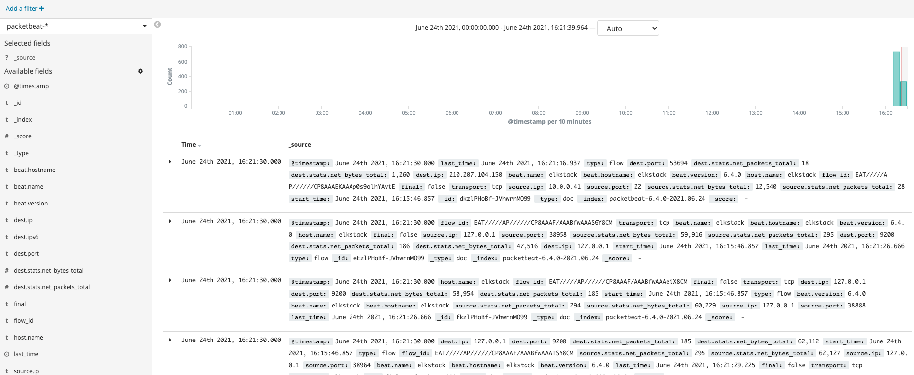
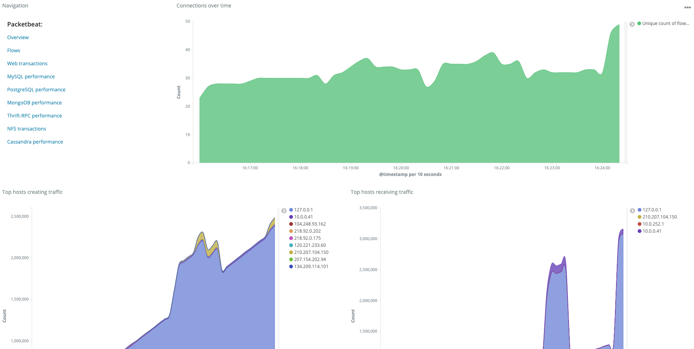

## 2.3 Packetbeat로 호스트 트래픽 수집
Packetbeat는 이름에서 유추할 수 있듯이, 네트워크 데이터를 수집하고 엘라스틱 서치로 인덱싱, 키바나로 시각화한다. Packetbeat를 사용하면, HTTP 통신 과정에서 데이터를 추출해 오류나 지연이 발생하는 즉시 확인할 수 있다.

Packetbeat는 HTTP 뿐만아니라 redis, Mysql, MongoDB 등 다양한 서비스 프로토콜을 지원한다.
원리는 pcap 라이브러리를 사용하여, 선택한 네트워크 디바이스의 패킷 정보를 추출 및 분석하여 엘라스틱 서치로 인덱싱한다.

Packetbeat 설정파일을 통해 네트워크 디바이스, 모니터링 대상 포트를 각각 지정하면, 해당 포트의 트래픽 데이터를 수집할 수 있다.
또한, 사용자의 목적에 따라 특정 프로토콜의 트래픽을 수집하도록 직접 구현도 가능하다.

### 2.3.1 Packetbeat 설정
```shell
vi $PACKETBEAT_HOME/packetbeat.yml
```
#### Network device 섹션
```shell
packetbeat.interfaces.device: any
```
위와같이 네트워크 장치를 `any`로 설정할 경우, 모든 네트워크 인터페이스의 트래픽을 수집한다.
`lo0`, 'eno1'등 네트워크 디바이스 명을 입력하여, 특정 네트워크 디바이스에서 발생되는 트래픽만을 수집할 수도 있다.

#### Flows 섹션
```shell
packetbeat.flows:
  timeout: 30s
  period: 10s
```
`timeout`은 해당 인터페이스 디바이스의 트래픽이 30초간 없으면 timeout을 발생시킨다.
`period`는 수집한 데이터를 기록하는 주기이다. 해당 주기가 짧으면 성능에 영향이 생기고, 너무 길면 주기 사이 오류 발생시 데이터가 유실될 수 있다.
주기는 트레이드 오프를 고려하여 워크로드에 맞춰 적절하게 설정해야한다.

#### Transaction Protocols 섹션
```shell
packetbeat.protocols:
- type: icmp
   # Enable ICMPv4 and ICMPv6 monitoring. Default: false
  enabled: true

- type: amqp
  # Configure the ports where to listen for AMQP traffic. You can disable
  # the AMQP protocol by commenting out the list of ports.
  ports: [5672]

- type: cassandra
  #Cassandra port for traffic monitoring.
  ports: [9042]

- type: dns
  # Configure the ports where to listen for DNS traffic. You can disable
  # the DNS protocol by commenting out the list of ports.
  ports: [53]

  # include_authorities controls whether or not the dns.authorities field
  # (authority resource records) is added to messages.
  include_authorities: true

  # include_additionals controls whether or not the dns.additionals field
  # (additional resource records) is added to messages.
  include_additionals: true

- type: http
  # Configure the ports where to listen for HTTP traffic. You can disable
  # the HTTP protocol by commenting out the list of ports.
  ports: [80, 8080, 8000, 5000, 8002]

```
트랜잭션 프로토콜 섹션에는 Packetbeat가 지원하는 서비스 프로토콜이 정의되어 있다. 네트워크 인터페이스로 유입되는 트래픽이 해당 트랜잭션 프로토콜 설정과 일치하면
데이터를 수집하고 Outputs 섹션에 정의된 대상에게 전달한다.

#### Outputs 섹션
```shell
output.elasticsearch:
 hosts: ["localhost:9200"]
```
출력 대상으로는 elasticsearch와 logstash를 설정할 수 있다.

### 2.3.2 Packetbeat로 데이터 수집

Packetbeat로 데이터를 수집해보자.

먼저, elasticsearch와 kibana를 실행하자.
```shell
$ELASTICSTACK_HOME/start.sh elasticsearch
$ELASTICSTACK_HOME/start.sh kibana
```
기본 설정된 프로토콜의 데이터를 호스트에서 수집을 할 것이다. 하지만, 대상 프로토콜이 사용자 권한을 벗어나
super user의 권한이 필요할 수도 있다. 따라서, Packetbeat실행과 설정 파일의 소유자 권한을 root로 설정하고,
root권한으로써 packetbeat를 실행해야한다.

```shell
sudo chown root:root $PACKETBEAT_HOME/packetbeat.yml
sudo $PACKETBEAT_HOME/packetbeat -e -c $PACKETBEAT_HOME/packetbeat.yml
```

```shell
2021-06-24T16:15:46.327+0900	INFO	instance/beat.go:544	Home path: [/home/elk/elasticbooks/project/elasticStack/programs/packetbeat] Config path: [/home/elk/elasticbooks/project/elasticStack/programs/packetbeat] Data path: [/home/elk/elasticbooks/project/elasticStack/programs/packetbeat/data] Logs path: [/home/elk/elasticbooks/project/elasticStack/programs/packetbeat/logs]
2021-06-24T16:15:46.331+0900	INFO	instance/beat.go:551	Beat UUID: ce3d36d6-812c-4262-acd1-039c5592ef21
2021-06-24T16:15:46.331+0900	INFO	[seccomp]	seccomp/seccomp.go:116	Syscall filter successfully installed
2021-06-24T16:15:46.332+0900	INFO	[beat]	instance/beat.go:768	Beat info	{"system_info": {"beat": {"path": {"config": "/home/elk/elasticbooks/project/elasticStack/programs/packetbeat", "data": "/home/elk/elasticbooks/project/elasticStack/programs/packetbeat/data", "home": "/home/elk/elasticbooks/project/elasticStack/programs/packetbeat", "logs": "/home/elk/elasticbooks/project/elasticStack/programs/packetbeat/logs"}, "type": "packetbeat", "uuid": "ce3d36d6-812c-4262-acd1-039c5592ef21"}}}
2021-06-24T16:15:46.332+0900	INFO	[beat]	instance/beat.go:777	Build info	{"system_info": {"build": {"commit": "34b4e2cc75fbbee5e7149f3916de72fb8892d070", "libbeat": "6.4.0", "time": "2018-08-17T22:27:29.000Z", "version": "6.4.0"}}}
2021-06-24T16:15:46.332+0900	INFO	[beat]	instance/beat.go:780	Go runtime info	{"system_info": {"go": {"os":"linux","arch":"amd64","max_procs":4,"version":"go1.10.3"}}}
2021-06-24T16:15:46.335+0900	INFO	[beat]	instance/beat.go:784	Host info	{"system_info": {"host": {"architecture":"x86_64","boot_time":"2021-06-07T11:51:51+09:00","containerized":false,"hostname":"elkstack","ips":["127.0.0.1/8","::1/128","10.0.0.41/22","fe80::aede:48ff:fe00:29/64","172.17.0.1/16"],"kernel_version":"4.15.0-43-generic","mac_addresses":["ac:de:48:00:00:29","02:42:6c:82:b8:e3"],"os":{"family":"debian","platform":"ubuntu","name":"Ubuntu","version":"18.04.1 LTS (Bionic Beaver)","major":18,"minor":4,"patch":1,"codename":"bionic"},"timezone":"KST","timezone_offset_sec":32400,"id":"e2a8b10b711be2886585d853db2c38f2"}}}
2021-06-24T16:15:46.336+0900	INFO	[beat]	instance/beat.go:813	Process info	{"system_info": {"process": {"capabilities": {"inheritable":null,"permitted":["chown","dac_override","dac_read_search","fowner","fsetid","kill","setgid","setuid","setpcap","linux_immutable","net_bind_service","net_broadcast","net_admin","net_raw","ipc_lock","ipc_owner","sys_module","sys_rawio","sys_chroot","sys_ptrace","sys_pacct","sys_admin","sys_boot","sys_nice","sys_resource","sys_time","sys_tty_config","mknod","lease","audit_write","audit_control","setfcap","mac_override","mac_admin","syslog","wake_alarm","block_suspend","audit_read"],"effective":["chown","dac_override","dac_read_search","fowner","fsetid","kill","setgid","setuid","setpcap","linux_immutable","net_bind_service","net_broadcast","net_admin","net_raw","ipc_lock","ipc_owner","sys_module","sys_rawio","sys_chroot","sys_ptrace","sys_pacct","sys_admin","sys_boot","sys_nice","sys_resource","sys_time","sys_tty_config","mknod","lease","audit_write","audit_control","setfcap","mac_override","mac_admin","syslog","wake_alarm","block_suspend","audit_read"],"bounding":["chown","dac_override","dac_read_search","fowner","fsetid","kill","setgid","setuid","setpcap","linux_immutable","net_bind_service","net_broadcast","net_admin","net_raw","ipc_lock","ipc_owner","sys_module","sys_rawio","sys_chroot","sys_ptrace","sys_pacct","sys_admin","sys_boot","sys_nice","sys_resource","sys_time","sys_tty_config","mknod","lease","audit_write","audit_control","setfcap","mac_override","mac_admin","syslog","wake_alarm","block_suspend","audit_read"],"ambient":null}, "cwd": "/home/elk/elasticbooks/project/elasticStack/programs/packetbeat", "exe": "/home/elk/elasticbooks/project/elasticStack/programs/packetbeat/packetbeat", "name": "packetbeat", "pid": 13926, "ppid": 13925, "seccomp": {"mode":"filter","no_new_privs":true}, "start_time": "2021-06-24T16:15:44.880+0900"}}}
2021-06-24T16:15:46.336+0900	INFO	instance/beat.go:273	Setup Beat: packetbeat; Version: 6.4.0
2021-06-24T16:15:46.338+0900	INFO	elasticsearch/client.go:163	Elasticsearch url: http://localhost:9200
2021-06-24T16:15:46.340+0900	INFO	pipeline/module.go:98	Beat name: elkstack
2021-06-24T16:15:46.341+0900	INFO	procs/procs.go:91	Process watcher disabled
2021-06-24T16:15:46.344+0900	INFO	[monitoring]	log/log.go:114	Starting metrics logging every 30s
2021-06-24T16:15:46.344+0900	INFO	instance/beat.go:367	packetbeat start running.
2021-06-24T16:16:01.010+0900	INFO	elasticsearch/client.go:708	Connected to Elasticsearch version 6.4.0
2021-06-24T16:16:01.011+0900	INFO	template/load.go:82	Loading template for Elasticsearch version: 6.4.0
2021-06-24T16:16:01.130+0900	INFO	template/load.go:145	Elasticsearch template with name 'packetbeat-6.4.0' loaded
```
설정값에 따라 모든 네트워크 인터페이스의 서비스 프로토콜로 발생된 트래픽 데이터를 주기적으로 수집한다.

### 2.3.3 키바나로 시각화
2.2 에서와 마찬가지로, Packetbeat의 `setup`명령을 통해, kibana설정을 수행하자.
```shell
sudo $PACKETBEAT_HOME/packetbeat -c $PACKETBEAT_HOME/packetbeat.yml setup --dashboards
```

Kibana UI에서 `discover`메뉴로 이동하여, Packetbeat로부터 수집된 정보가 출력되는지 확인하자.


`Dashboard`메뉴로 이동하여, Packetbeat 대시보드를 찾아 선택하자.
