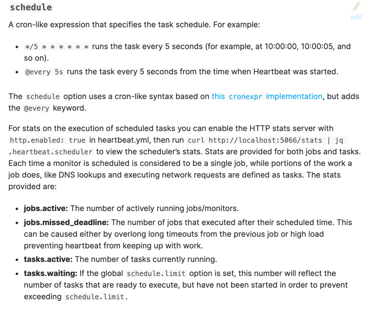
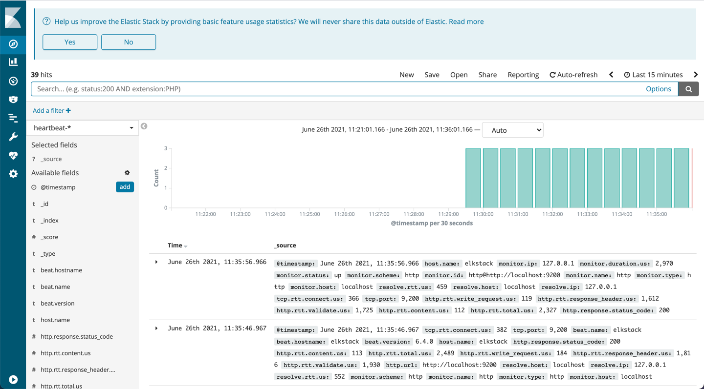
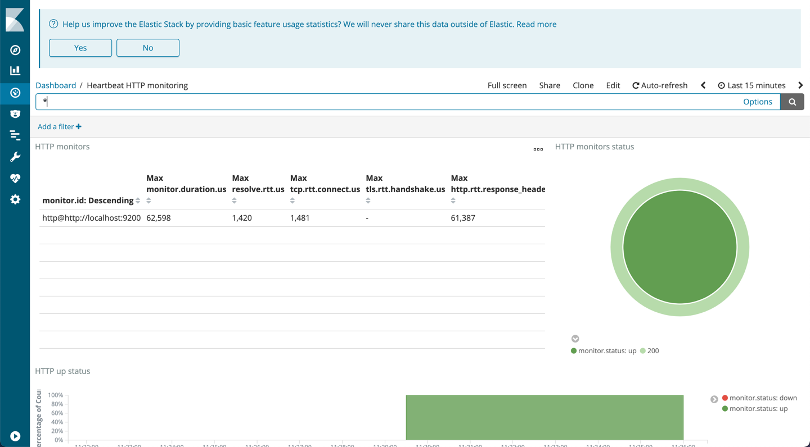

## 2.4 Heatbeat로 호스트 헬스 체크
Heartbeat는 서버의 상태를 주기적으로 알려주는 도구이다. Heartbeat는 다른 비츠 제품과 같이 동작우인 서버에
에이전트로 설치된다. 설정에 따라 엘라스틱서치나 로그스태시에게 주기적으로 서버의 상태 등 여러 정보를 전달한다.

Heartbeat와 Metricbeat 모두 서버의 정보를 주기적으로 전달하지만, 이 둘은 대상과 목적에 차이점을 가지고있다.
Metricbeat의 경우, 호스트에서 사용하는 리소스의 쉬 데이터를 다루는 반면, Heartbeat는 서버가 살았는지 죽었는지,
특정 서비스나 프로세스가 동작하는지, 지연시간이 길지는 않은지 등 서버의 상태 정보를 다룬다.

Hearbeat 는 ICMP(Internet Control Message Protocol)와 TCP, HTTP 프로토콜 모니터링을 지원한다.
또한, TCP, HTTP에서 SSL/TLS와 프록시를 지원한다. 로드밸런서로 분산된 서버 환경에서는 DNS 분석 기법을 사용해 모니터링 할 수 있다.

### 2.4.1 Heatbeat 설정
Heartbeat 설정파일을 확인해보자
```shell
vi $HEARTBEAT_HOME
```

####Monitoring 섹션
```shell
heartbeat.monitors:
- type: http
  url: ["http://localhost:9200"]
  schedule: '@every 10s'
  #timeout: 16s
```
`type`은 Hearbeat가 모니터링할 대상 프로토콜의 유형이다. `ICMP`, `TCP`, `HTTP` 중 선택하여 작성한다.
`urls`에는 모니터링 대상 URL을 지정한다. http타입의 경우 URL이 작성되어야한다.
`schedule`은 모니터링 주기르 작성한다. 위와같이 `@every`형태의 문법을 사용할 수 있지만, `cron` 문법도 사용 가능하다.
`timeout`은 설정 시간 동안 모니터링 대상이 음답하지 않을 경우 타임아웃을 발생시킨다.``

아래는 heartbeat 모니터링 스케쥴의 타입별 작성요령에 대한 공식 가이드 내 문서이다.

(*출처: https://www.elastic.co/guide/en/beats/heartbeat/current/monitor-options.html*)

####Output 섹션
```shell
output.elasticsearch:
  hosts: ["localhost:9200"]
  protocol: "https"
  username: "username"
  password: "pasword"
```
이전 장과 대개 동일한 구조이다. XPach에서의 Authentication을
사용할 경우 프로토콜과 로그인 정보를 별도 지정해야한다.

```shell
output.logstash:
  hosts: ["localhost:9200"]
  ssl.certificate_authorities: ["/etc/pki/root/ca.pem"]
  ssl.certificate: "/etc/pki/client/cert.pem"
  ssl.key: "/etc/pki/client/cert.key"
```
이전 장과 대개 동일한 구조이다.
logstash가 통신구간 내 SSL을 적용했을 경우, 위와같이 ssl 설정을 추가 작성할 수 있다.

### 2.4.2 Heartbeat로 데이터 수집
이전 장과 동일하게 Heartbeat로 부터 데이터 수집을 진행한다.

엘라스틱서치와 키바나를 실행한다.
```shell
$ELASTICSTACK_HOME/start.sh elasticsearch
$ELASTICSTACK_HOME/start.sh kibana
```

Heartbeat를 실행한다.
```shell
$HEARTBEAT_HOME/heartbeat -e -c $HEARTBEAT_HOME/heartbeat.yml
```

정상 구동되면 아래와 같이 로그가  출력된다.


주기마다 로그에 데이터 수집 로그가 작성되는 것을 확인할 수 있다.


### 2.4.3 키바나로 시각화
키바나 설정은 이전 장과 동일하다. setup 명령을 통해 키바나 설정을 진행하면 간편하게 Kibana UI에서 Hearbeat의 모니터링 데이터를 확인할 수 있다.

```shell
$HEARTBEAT_HOME/heartbeat -c $HEARTBEAT_HOME/heartbeat.yml setup --dashboards
```

Kibana UI의 Discover와 Dashbaord 메뉴를 통해, 수집된 데이터가 모니터링되는지 확인하자.


