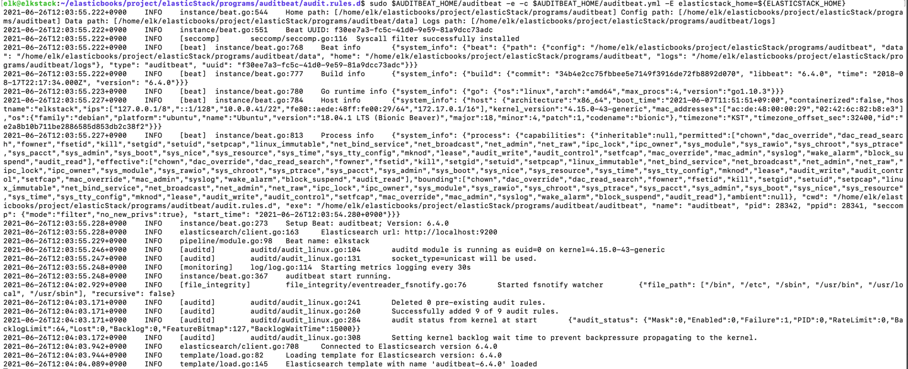
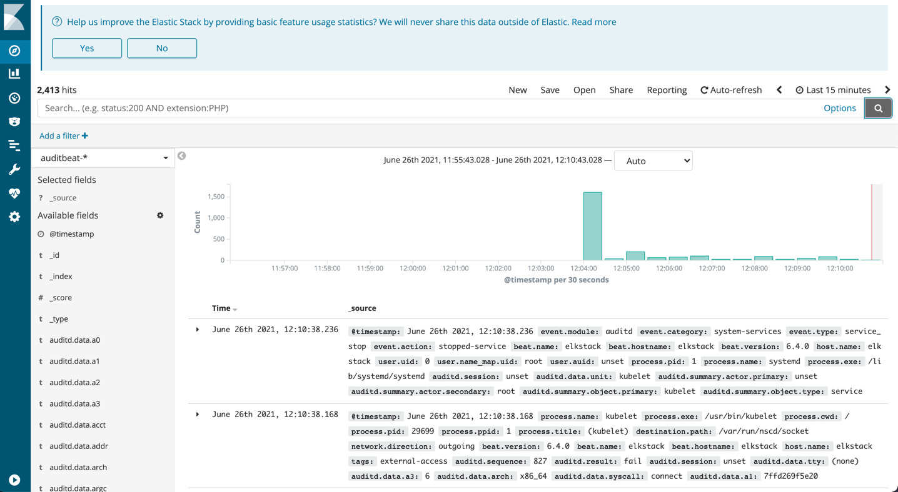
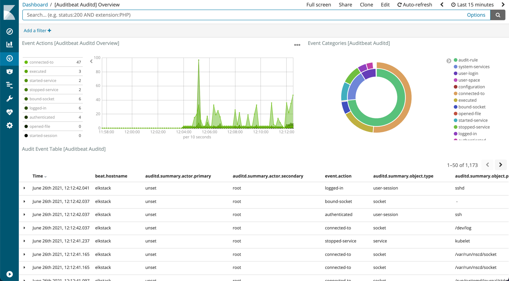
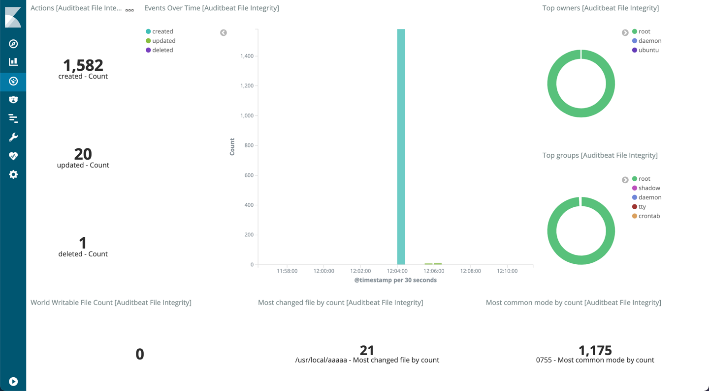

## 2.5 Auditbeat로 호스트 이벤트 수집
Auditbeat는 시스템상의 사용자와 프로세스 활동을 감사(감독하고 검사)하는 경량 에이전트이다.
설치된 호스트의 중요한 파일이나 설정 변경을 감지해 보안 정책 위반 행위에 대응하기 위해 고안됐다.
누군가의 잘못된 행동 떄문에 서버에 보안 취약점이 생기거나 서버의 장애를 발생할 수 있다. 감사 시스템은
직접 개발하기 쉽지 않지만 Auditbeat를 사용하면 간단하게 구축할 수 있다.

### 2.5.1 Auditbeat 설정
먼저, Auditbeat의 설정 정보를 확인해보자.
```shell
vi $AUDITBEAT_HOME/auditbeat.yml
```

####modules 섹션
```shell
auditbeat.modules:

- module: auditd
  # Load audit rules from separate files. Same format as audit.rules(7).
  audit_rule_files: [ '${path.config}/audit.rules.d/*.conf' ]
  audit_rules: |
    ## Define audit rules here.
    ## Create file watches (-w) or syscall audits (-a or -A). Uncomment these
    ## examples or add your own rules.

    ## If you are on a 64 bit platform, everything should be running
    ## in 64 bit mode. This rule will detect any use of the 32 bit syscalls
    ## because this might be a sign of someone exploiting a hole in the 32
    ## bit API.
    #-a always,exit -F arch=b32 -S all -F key=32bit-abi

    ## Executions.
    #-a always,exit -F arch=b64 -S execve,execveat -k exec

    ## External access (warning: these can be expensive to audit).
    #-a always,exit -F arch=b64 -S accept,bind,connect -F key=external-access

    ## Identity changes.
    #-w /etc/group -p wa -k identity
    #-w /etc/passwd -p wa -k identity
    #-w /etc/gshadow -p wa -k identity

    ## Unauthorized access attempts.
    #-a always,exit -F arch=b64 -S open,creat,truncate,ftruncate,openat,open_by_handle_at -F exit=-EACCES -k access
    #-a always,exit -F arch=b64 -S open,creat,truncate,ftruncate,openat,open_by_handle_at -F exit=-EPERM -k access
```
`auditd` 모듈은 리눅스 커널의 일부를 감사하는 모듈이다. 즉, 감사 대상은 리눅스 커널이며, 리눅스에서만 동작한다. 설정방법은 크게 2가지이다.

`audit-rule_files`에 지정한 경로의 파일에서 설정을 가져와 적용하는 방법과
`audit_rules`에 직접 설정을 입력하는 것이다.
(audit_rules 학습 필요)

다음은 `file_integrity` 모듈이다.
```shell
- module: file_integrity
  paths:
  - /bin
  - /usr/bin
  - /sbin
  - /usr/sbin
  - /etc
```
`file_integrity` 모듈은 파일이 생성, 삭제, 변경되몀ㄴ 이벤트를 감지하고 데이터를 수집한다. 변경을 감지할 대상 파일은 위에 작성된 `paths`가 대상이다.
Auditbeat가 최초에 실행될 때, 지정된 디렉터리 안에 파일 정보를 기록하고 변경이 발생하면 운영체제로부터 이벤트를 받고 데이터를 수집한다.
OS 커널과 통신하려면 커널 통신 도구가 필요하다. 리눅스의 경우 `inotify`, 맥 OS는 `FSEvents`, 윈도우즈의 경우 `ReadDirectoryChanges`를 이벤트 수신에 사용한다.

####outputs 섹션
이전 장과 동일하다.

```shell
#-------------------------- Elasticsearch output ------------------------------
output.elasticsearch:
  # Array of hosts to connect to.
  hosts: ["localhost:9200"]

  # Optional protocol and basic auth credentials.
  #protocol: "https"
  #username: "elastic"
  #password: "changeme"
```

```shell
#----------------------------- Logstash output --------------------------------
#output.logstash:
  # The Logstash hosts
  #hosts: ["localhost:5044"]

  # Optional SSL. By default is off.
  # List of root certificates for HTTPS server verifications
  #ssl.certificate_authorities: ["/etc/pki/root/ca.pem"]

  # Certificate for SSL client authentication
  #ssl.certificate: "/etc/pki/client/cert.pem"

  # Client Certificate Key
  #ssl.key: "/etc/pki/client/cert.key"
```

### 2.5.2 Auditbeat로 데이터 수집
이전 장과 동일하게 Heartbeat로 부터 데이터 수집을 진행한다.

엘라스틱서치와 키바나를 실행한다.
```shell
$ELASTICSTACK_HOME/start.sh elasticsearch
$ELASTICSTACK_HOME/start.sh kibana
```

Auditbeat의 경우 Packetbeat와 마찬가지로 root 권한이 필요하다. Auditbeat 실행뿐 아니라 설정 파일의 소유자에도 root 권한을 부여해야한다.
```shell
sudo chown root:root $AUDITBEAT_HOME/auditbeat.yml
```

root 권한으로 Heartbeat를 실행한다.
```shell
sudo $AUDITBEAT_HOME/auditbeat -e -c $AUDITBEAT_HOME/auditbeat.yml
```

정상 구동되면 아래와 같이 로그가  출력된다.


### 2.5.3 키바나로 시각화
키바나 설정은 이전 장과 동일하다. setup 명령을 통해 키바나 설정을 진행하면 간편하게 Kibana UI에서 Auditbeat의 모니터링 데이터를 확인할 수 있다.

```shell
$AUDITBEAT_HOME/Auditbeat -c $AUDITBEAT_HOME/auditbeat.yml setup --dashboards
```

Kibana UI의 Discover와 Dashbaord 메뉴를 통해, 수집된 데이터가 모니터링되는지 확인하자.



**Overview**


**File Integrity**

