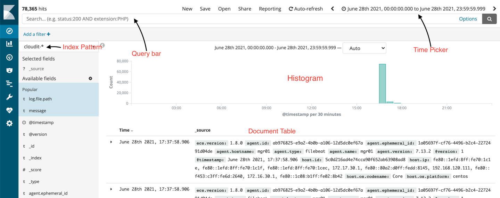
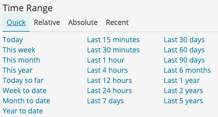
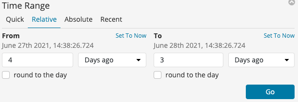
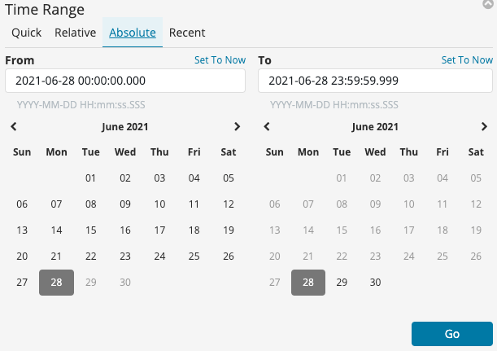
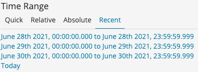
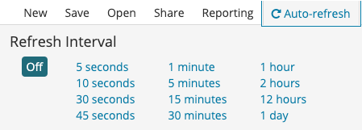

## 3.1 Discover
엘라스틱서치에 인덱싱된 데이터는 키바나의 Discover 메뉴에서 확인할 수 있다.
Discover 메뉴의 구조는 아래와 같다.

1. Document Table : 엘라스틱서치로부터 인덱싱 된 데이터를 키바나의 Index Pattern에 지정된 타임 스탬프 값에 따라 시간순으로 나열한다.
2. Histogram : 타임스탬프 값 기준으로 시간별 유입된 데이터량을 확인할 수 있다.
3. Query bar : 원하는 데이터를 색인하기 위해, 쿼리를 작성할 수 있다.
4. Time Picker : 찾고자하는 데이터를 타임 스탬프 기준으로 색인할 수 있다.

###3.1.1 타임 피커
타임 피커는 Discover 메뉴 뿐만아니라 Kibana 전역에서 사용하는 시간 값이자, 엘라스틱서치에게 요청할 데이터의 시간 범위이다.
시각화(Visualizer)를 통해 만든 차트는 타임 피커로 선택된 시간 범위만 표현하기 때문에, 실제 시각화 도구를 사용하는 경우에 타임 피커를 수정하는 일이 많다.

타임 피커는 키바나의 우측 상단 시계 모양을 클릭하여 변경할 수 있다. 기본 값은 Last 15 minutes(최근 15분)이다. 타임 피커의 범위가 넓을 수록 탐색해야할 데이터도
많아지기 때문에, 키바나 운영의 성능이 저하될 수 있다.

*Quick*

Quick에는 자주 사용할 만한 시간 범위가 사전 정의되어있다. 15분 전부터 5년까지 정의된 범위로 빠르게 변경할 수 있다. 

*Relative*

Relative는 Quick보다 세밀한 설정이 가능하다. 시간의 범위로써, 몇분 전부터 몇분 전까지 범위의 시작과 끝을 지정할 수 있다.
초, 분, 시간, 년도 단위로 지정이 가능하다. 

*Absolute*

Absolute는 타임피커 중 시간을 가장 세밀하게 조정할 수 있다. 일시를 작성가능하며, 초는 밀리초까지 지원한다.

*Recent*

최근 타임피커로 선택된 범위의 리스트를 출력한다.

*Auto-refresh*

시간 범위 내 새로운 데이터가 있는지 지정된 시간 단위로 새로 고침을 수행한다. 초단위부터 시간 단위, 최대 하루 단위로 자동 새로고침이 가능하다.

